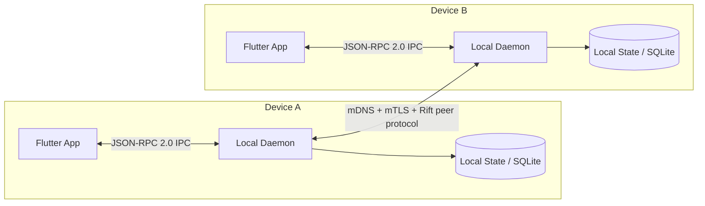
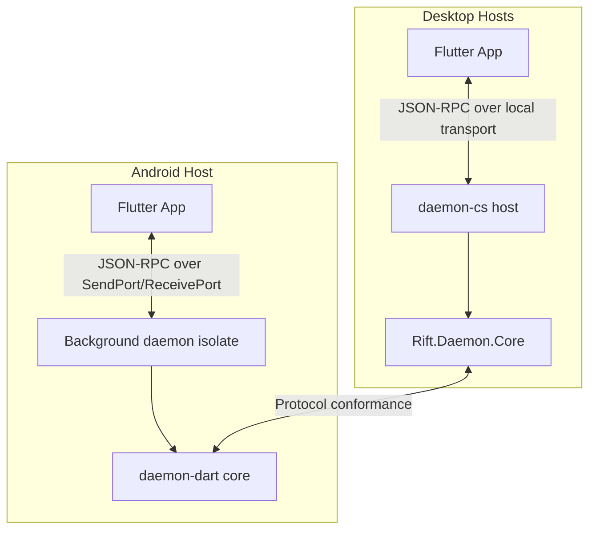
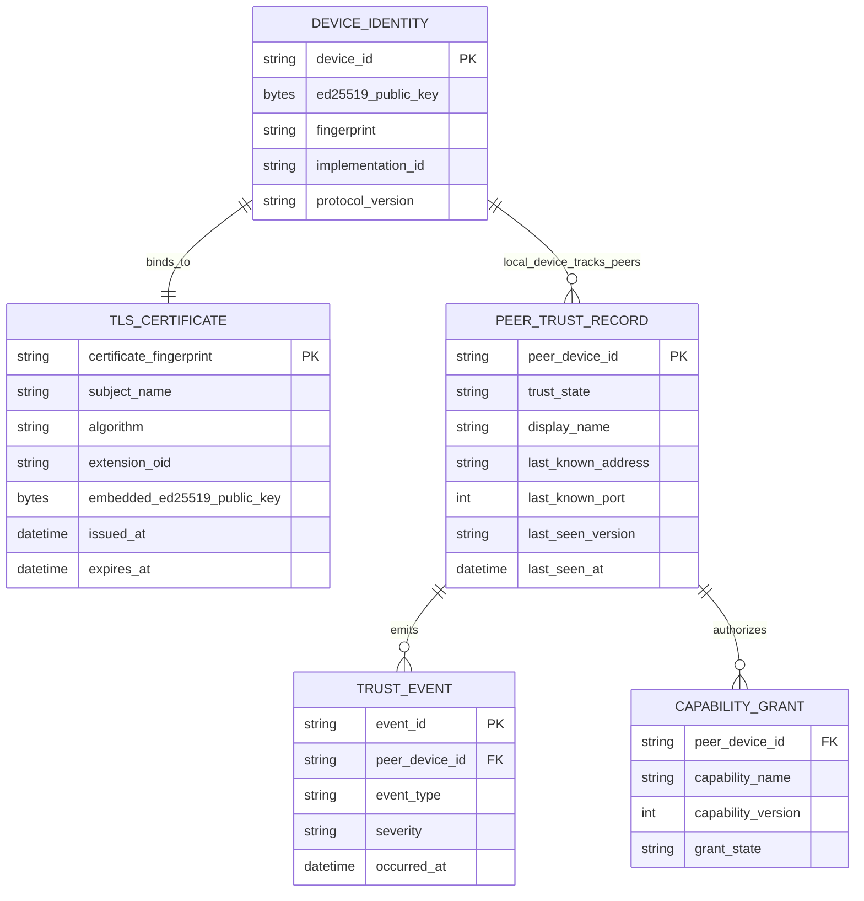
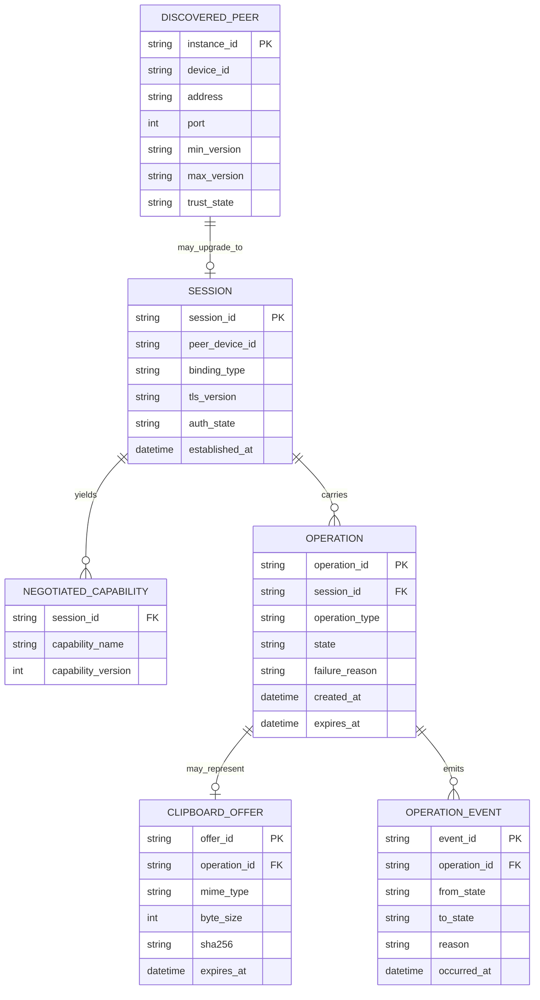
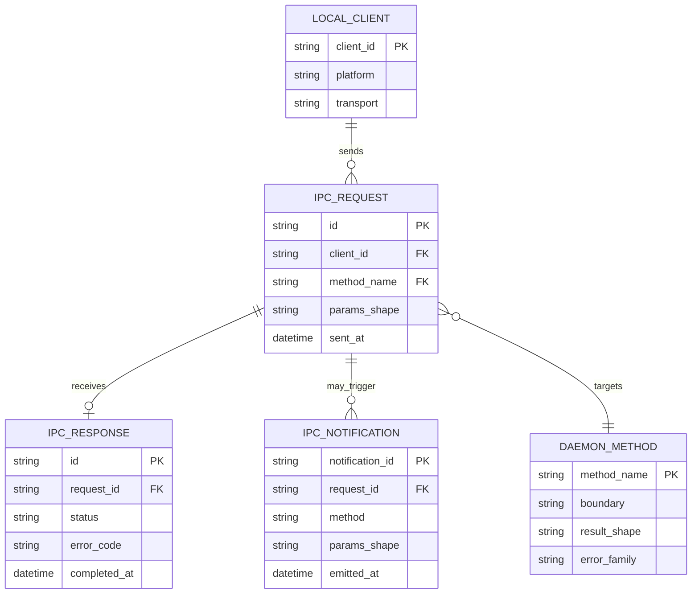

# Rift Architecture and ERDs

## Scope

This document describes the canonical architecture surfaced by the repository
specifications and component READMEs. The ERDs below are conceptual data models
for protocol and daemon state, not a physical SQLite schema.

## Architecture Summary

Rift is a protocol-first, local-first device continuity system with one written
specification and two independent daemon implementations. The protocol and IPC
specs are the source of truth; the C# daemon family and the Dart Android daemon
must conform to them rather than define their own behavior.

The runtime has three major layers:

1. Peer protocol layer: daemon-to-daemon discovery, mutual TLS, Ed25519 proof
   of possession, trust-state enforcement, capability negotiation, clipboard
   offer/fetch, presence, and operation lifecycle.
2. Local daemon layer: identity generation, trust/persistence, event logging,
   session handling, and enforcement of all security-sensitive state.
3. Client layer: one Flutter app that talks to the local daemon over a single
   JSON-RPC 2.0 contract, using named pipes on Windows, Unix sockets on
   macOS/Linux, and isolate ports on Android.

## System Context

## Deployment View

## Trust and Identity Model

- Each device owns a long-term Ed25519 keypair for device identity.
- Each device also owns an ECDSA P-256 keypair for mutual TLS.
- The Ed25519 public key is embedded in the TLS certificate via a custom X.509
  extension and then proven post-handshake with Ed25519 PoP.
- Trust state is durable and explicit: `discovered`, `pairing_pending`,
  `trusted`, `blocked`, `revoked`.
- Private keys never cross the IPC boundary and never leave the daemon.

## ERD 1: Identity, Peer, Trust, and Certificate

## ERD 2: Session, Discovery, Operation, and Clipboard Flow

## ERD 3: IPC and Local Client Boundary

## Verification Architecture

The architecture is defended by three test layers:

- Conformance tests validate both daemon implementations against the written
  protocol contract.
- Interoperability tests exercise the C# and Dart daemons together end-to-end.
- Component tests and security-focused validation cover parser behavior,
  transport bootstrap, and IPC error mapping.

## Notes and Boundaries

- These ERDs are intentionally conceptual. The canonical docs define protocol
  entities and state transitions, but not a final normalized persistence schema.
- If a future SQLite schema is documented in canonical repo docs, a physical ERD
  should be produced separately rather than silently replacing this one.
- The daemon is the sole authority for identity, trust, certificates, sessions,
  and event logs. The Flutter app is a transport-agnostic client, not a second
  source of truth.
