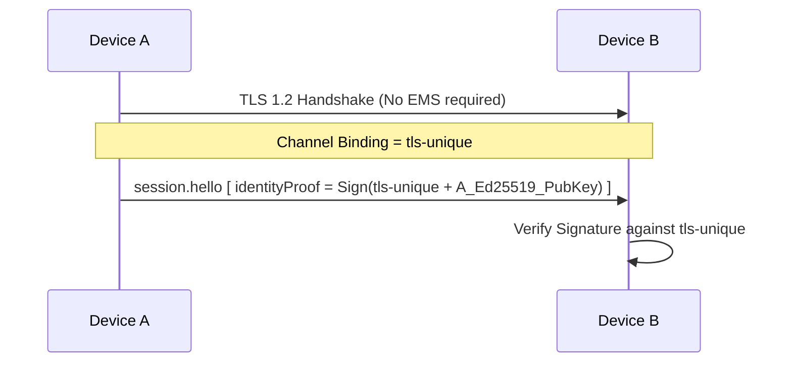
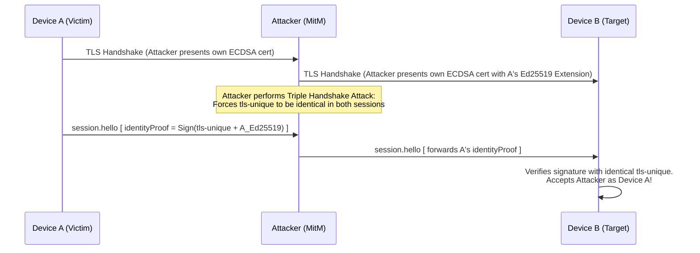
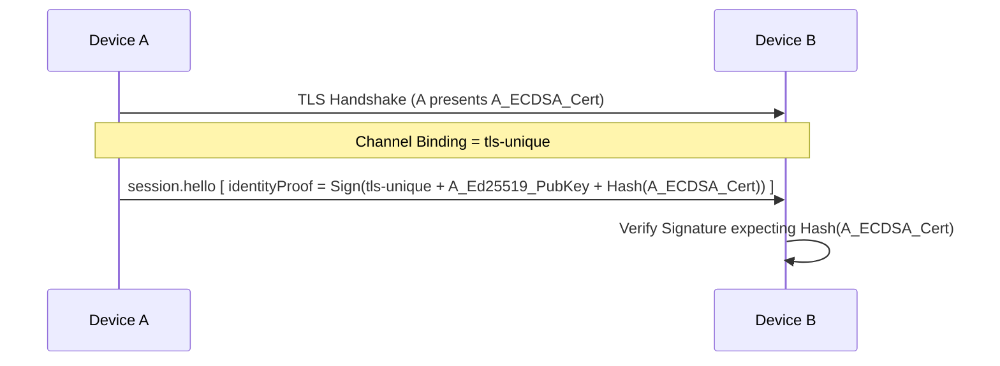
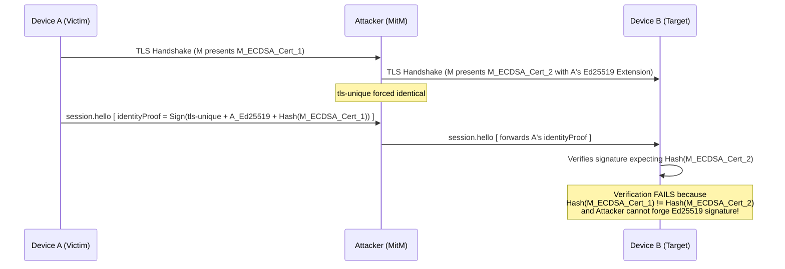

# TLS-Unique Triple Handshake Identity Misbinding

## Description
The protocol specifies the use of `tls-unique` (RFC 5929) for the channel binding in the Ed25519 Proof of Possession (PoP) step when TLS 1.3's `tls-exporter` is not available (such as in TLS 1.2 fallback). However, the protocol does not mandate the use of the Extended Master Secret (EMS, RFC 7627) for TLS 1.2 connections. Without EMS, `tls-unique` is vulnerable to the Triple Handshake Attack (CVE-2014-1295). An active Man-in-the-Middle (MitM) attacker can synchronize the master secret and `tls-unique` values across two separate TLS sessions. Because the PoP signature only binds the channel and the signer's Ed25519 public key, the attacker can seamlessly replay the victim's PoP signature to the target device. By embedding the victim's Ed25519 public key inside the attacker's own ECDSA certificate extension, the attacker successfully impersonates the victim and completely bypasses the Proof of Possession check.

## Diagram of the design part where it's vulnerable

## Diagram of the attacker's side

## The fix
Update Section 5.3.1 to include the SHA-256 hash of the signer's own DER-encoded ECDSA P-256 certificate in the Ed25519 PoP signing input. Alternatively, strictly mandate the Extended Master Secret (EMS) extension for TLS 1.2 connections. The most robust cryptographic fix at the application layer is binding the PoP directly to the ECDSA certificate used in the TLS session. Additionally, update the signing input string to `"RiftPoP-v2:"` to prevent version downgrade or cross-version replay attacks.

## Diagram of the fixed design part

## Diagram of the attacker's side with the new design

