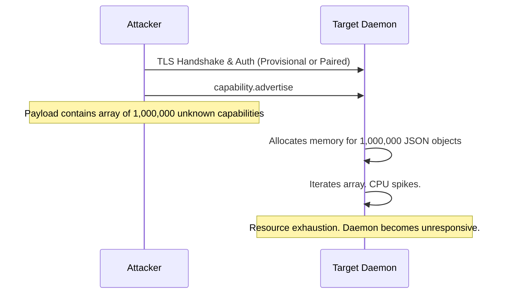
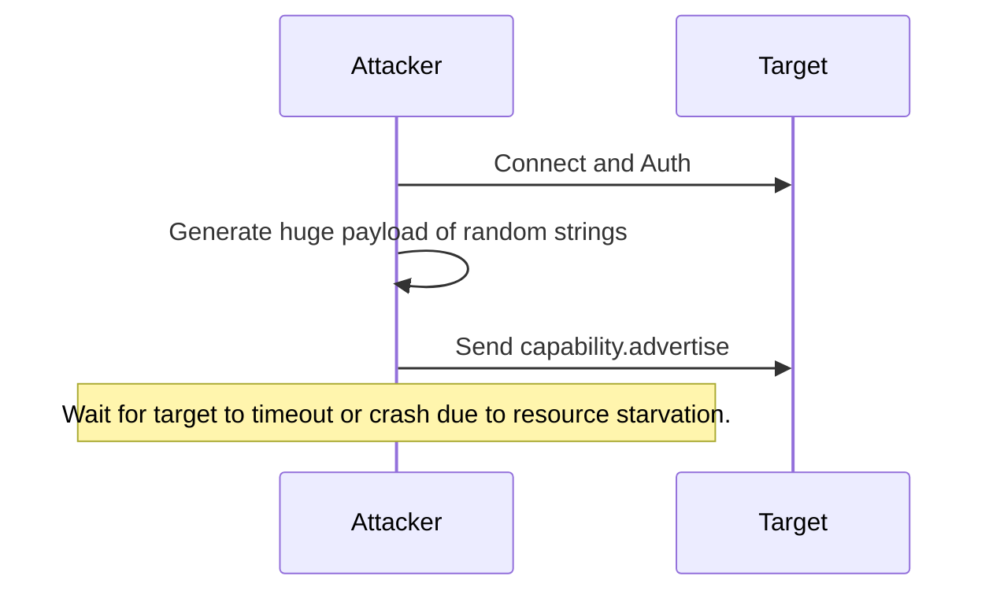
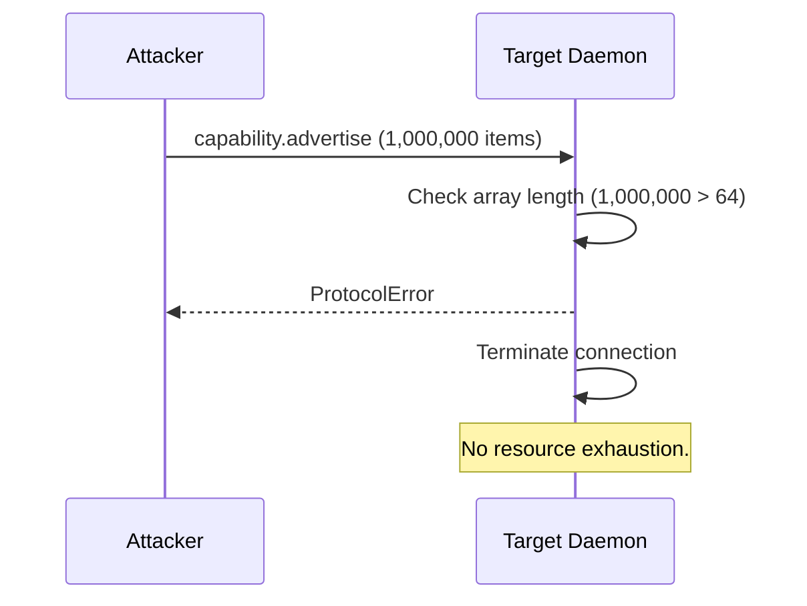
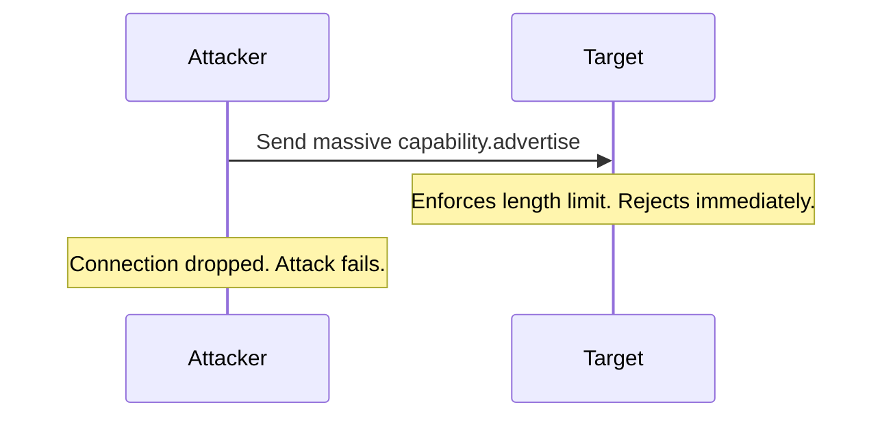

# 7. Medium. Unbounded Capabilities Negotiation

## Description
Section 9.1 defines the capability object schema and states that capability names are a closed set in v0.1-draft. However, Section 9.4 (Version Mismatch and Forward Compatibility) explicitly mandates: "Unknown capability names in a peer's advertisement MUST be silently ignored. This allows future protocol versions to introduce new capabilities without breaking v0.1-draft peers."
The specification does not place a limit on the number of capabilities a peer can advertise or the length of the strings within the capability objects (like `name` or elements of `policyFlags`). An attacker could send a `capability.advertise` message containing millions of randomly generated, unknown capability names. The receiver, following Section 9.4, would attempt to parse the massive JSON array and iterate through it to filter and silently ignore the unknown ones. This leads to CPU and memory exhaustion, resulting in a Denial of Service.

## Diagram of the vulnerable design

## Diagram of the attacker's side

## The fix
Section 9 MUST define strict upper bounds for the capability negotiation arrays and strings. 
1. The `capabilities` array in both `session.hello` and `capability.advertise` MUST be limited to a reasonable maximum number of items (e.g., 64).
2. The lengths of `name` and items in `policyFlags` MUST be strictly bounded (e.g., 128 characters max).
3. If a peer sends a capability advertisement exceeding these limits, the receiver MUST immediately reject the message with `ProtocolError` and terminate the session.

## Diagram of the fixed design

## Diagram of the attacker's side with the new design

