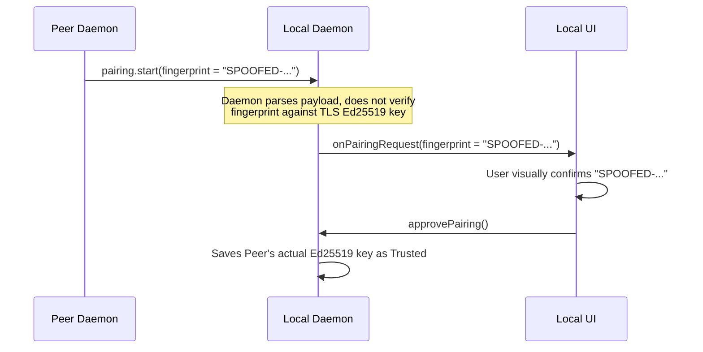
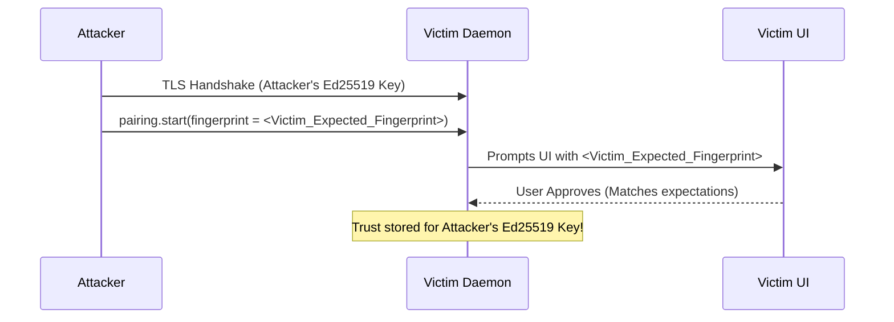
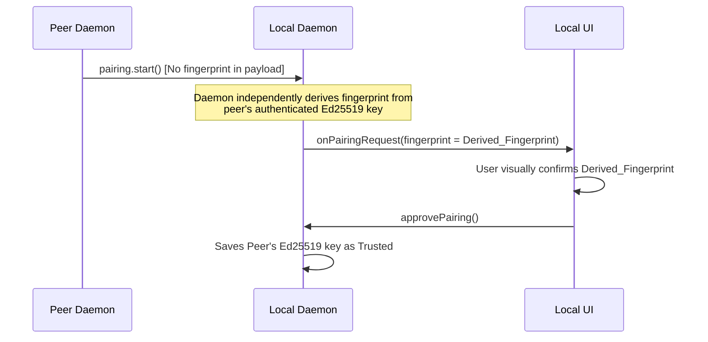
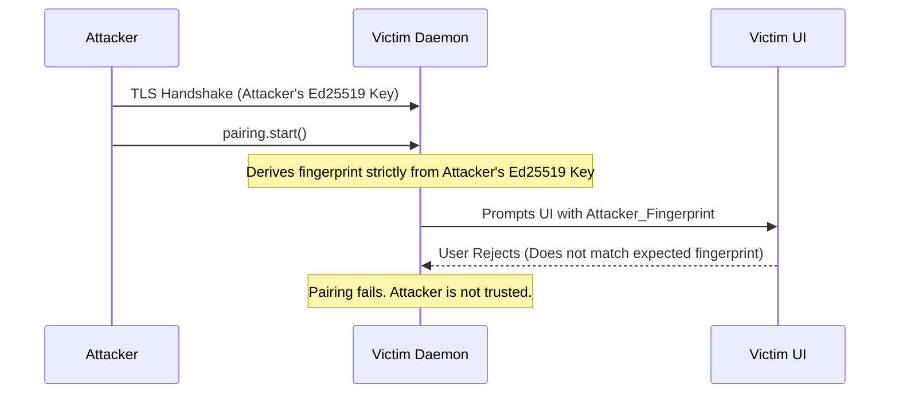

# Pairing Fingerprint Spoofing via Payload Trust

## Description
In Section 7.3, the `pairing.start` message schema includes a `fingerprint` field directly in its payload. However, the specification does not explicitly mandate that the receiving daemon must independently verify that this payload `fingerprint` matches the cryptographically derived fingerprint of the peer's Ed25519 public key (which is securely extracted during the TLS handshake). If an implementation parses the payload's `fingerprint` and forwards it to the UI (e.g., via the `rift.onPairingRequest` IPC event), an attacker can supply an arbitrary spoofed fingerprint. The victim user will verify and approve the visually expected fingerprint, but the daemon will persist trust for the attacker's actual Ed25519 key. This completely circumvents the visual fingerprint verification mechanism.

## Diagram of the design part where it's vulnerable

## Diagram of the attacker's side

## The fix
Remove the `fingerprint` field entirely from all payload definitions in Section 7.3 (`pairing.start`, `pairing.approve`, `pairing.complete`). The daemon MUST ALWAYS derive the fingerprint locally using the cryptographically verified Ed25519 public key obtained from the current TLS session's certificate extension. The local daemon must then pass this locally-derived fingerprint to the UI. If the field is retained for debugging, the specification MUST mandate that the receiver reject the message with a `ProtocolError` if the payload fingerprint does not exactly match the locally derived fingerprint.

## Diagram of the fixed design part

## Diagram of the attacker's side with the new design

