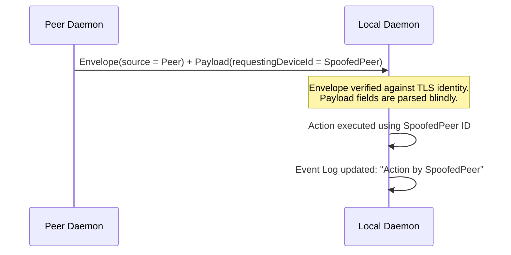
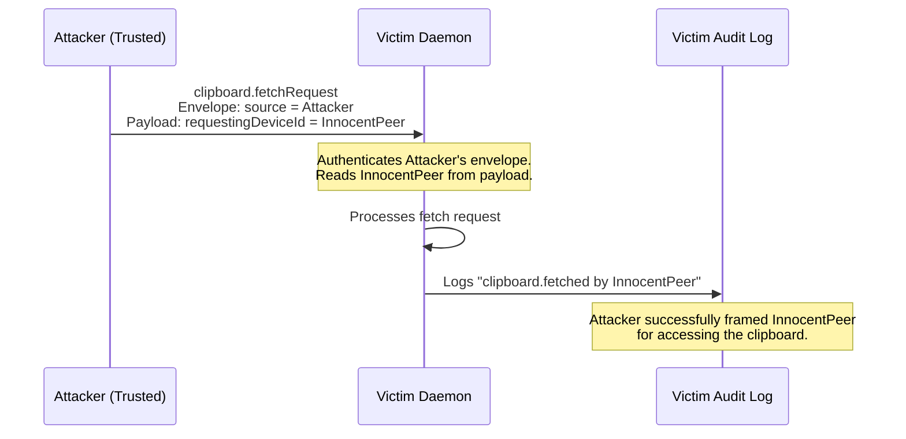
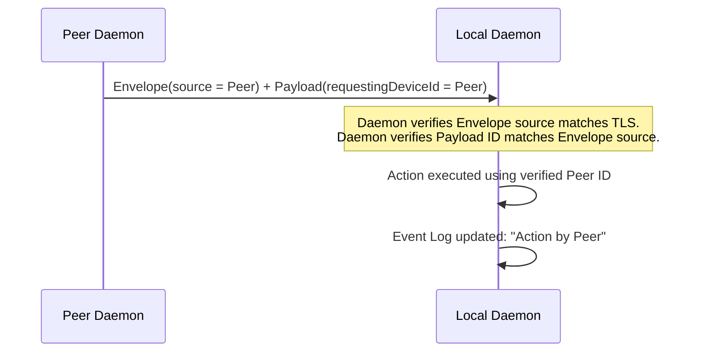
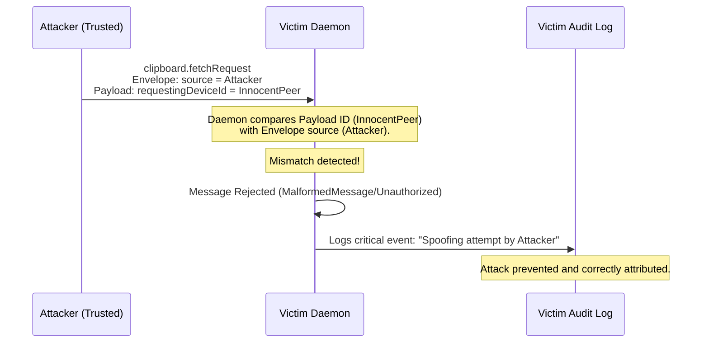

# Audit Log Spoofing via Unverified Payload Identity Fields

## Description
The protocol defines identity fields both in the authenticated message envelope (`sourceDeviceId`) and redundantly inside various message payloads (e.g., `sourceDeviceId` in `clipboard.offer`, `requestingDeviceId` in `clipboard.fetchRequest`). While the specification mandates that the envelope's `sourceDeviceId` must match the session's verified Ed25519 identity, it fails to mandate that payload identity fields must match the authenticated envelope. A malicious but trusted peer can send a valid envelope containing their own identity, while placing the device ID of a different trusted peer in the payload. If the receiving daemon uses these unverified payload fields for state updates or audit logging (e.g., logging a `clipboard.fetched` event based on the spoofed `requestingDeviceId`), the attacker can frame other peers for unauthorized actions, poison the security audit log, and potentially cause denial-of-service conditions.

## Diagram of the design part where it's vulnerable

## Diagram of the attacker's side

## The fix
Remove redundant identity fields from message payloads. The daemon MUST rely exclusively on the envelope's `sourceDeviceId` (which is cryptographically bound to the TLS session) and the envelope's `destinationDeviceId` for all business logic, routing, and audit logging. If removing the payload fields breaks backwards compatibility, the specification MUST strongly mandate that the receiving daemon validates all identity fields inside payloads to ensure they perfectly match the authenticated envelope. Any mismatch MUST result in immediate message rejection with `MalformedMessage` or `Unauthorized`, and a `critical` security event must be logged.

## Diagram of the fixed design part

## Diagram of the attacker's side with the new design

