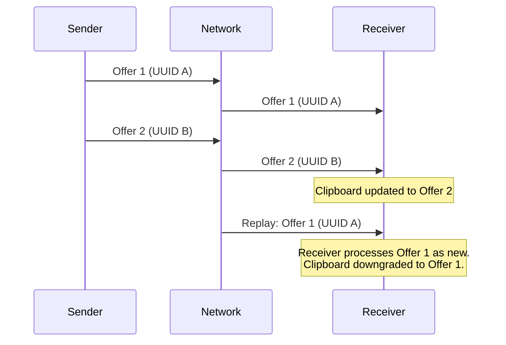
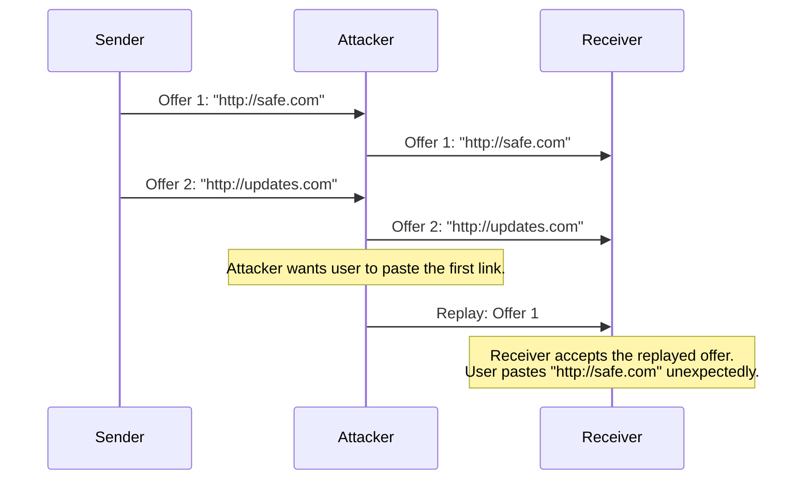
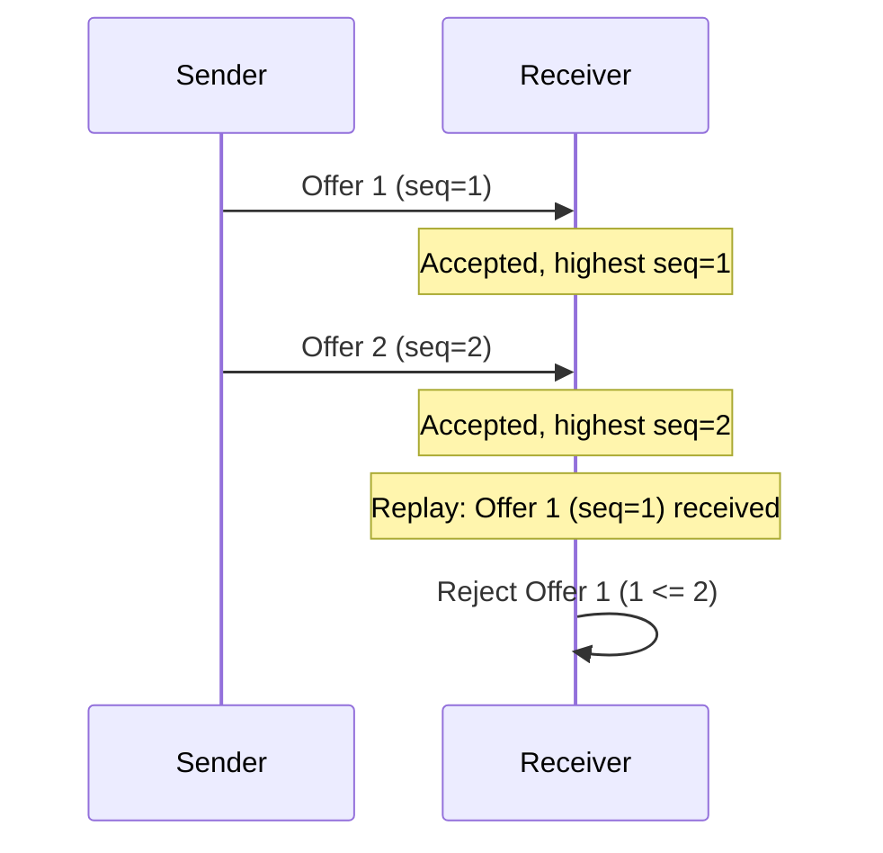
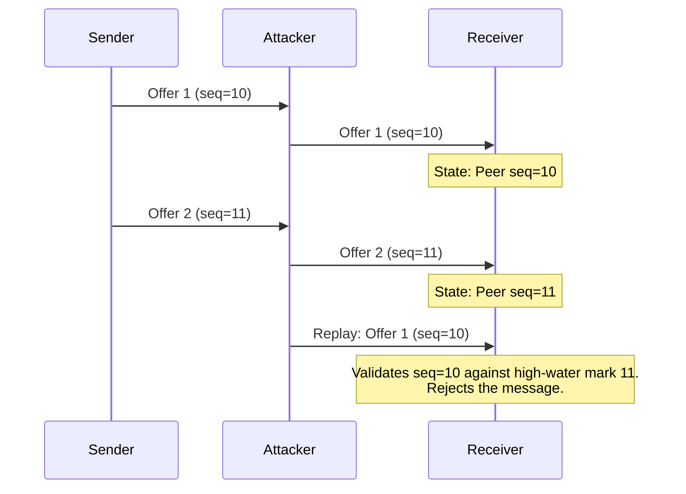

# Clipboard Offer Replay and Downgrade

## Description
In Section 11, the protocol specifies clipboard offers with an `expiresInMs` field interpreted using local monotonic timers. However, the offer message payload lacks any monotonic offer generation timestamp, sequence number, or anti-replay token. While the transport is encrypted, a compromised intermediate relay, or an attacker capable of delaying and re-ordering packets within the valid TLS session window, could replay an older valid `clipboard.offer` sent by a peer. If a peer sends a sequence of clipboard updates rapidly, an attacker could replay a slightly older offer just before the current offer expires. Since the `offerId` is a UUIDv4 and there is no strict ordering enforced, the receiving daemon will accept the replayed offer, potentially overwriting newer clipboard contents with older ones on the victim's device, or tricking the user into pasting stale/malicious data.

## Diagram of the design part where it's vulnerable

## Diagram of the attacker's side

## The fix
Introduce a strictly increasing monotonic sequence number (`sequenceNumber`) or a monotonic logical clock timestamp (`logicalTimestamp`) within the `clipboard.offer` message payload per peer. The receiving daemon MUST maintain the highest seen sequence number for each trusted peer and completely reject any incoming `clipboard.offer` with a sequence number less than or equal to the currently stored high-water mark.

## Diagram of the fixed design part

## Diagram of the attacker's side with the new design

