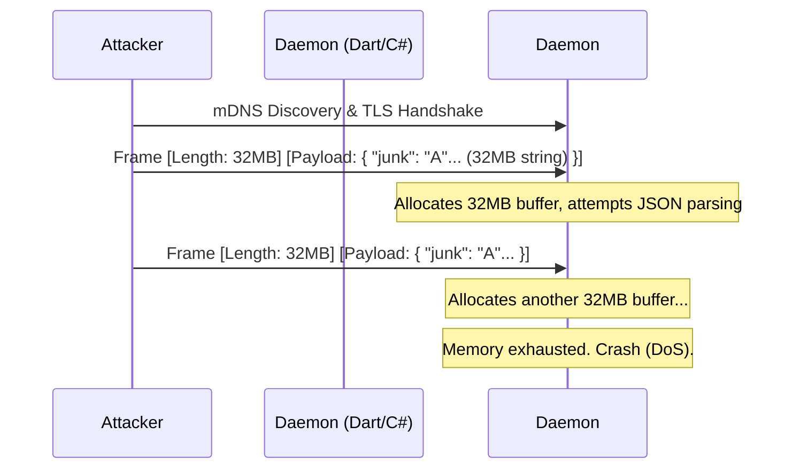
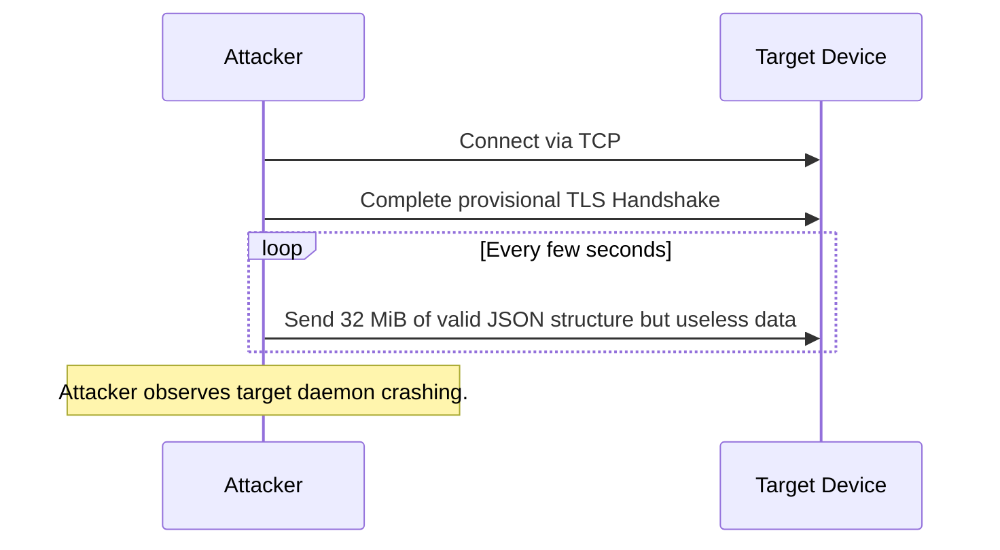
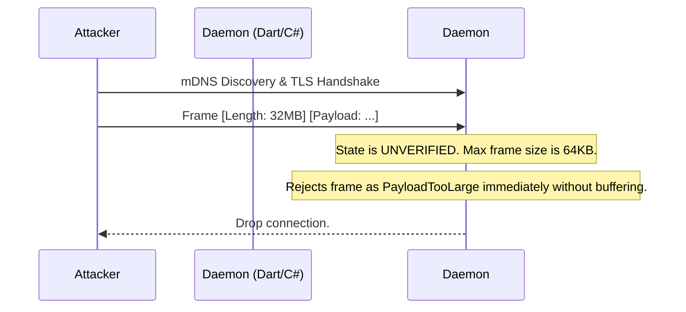
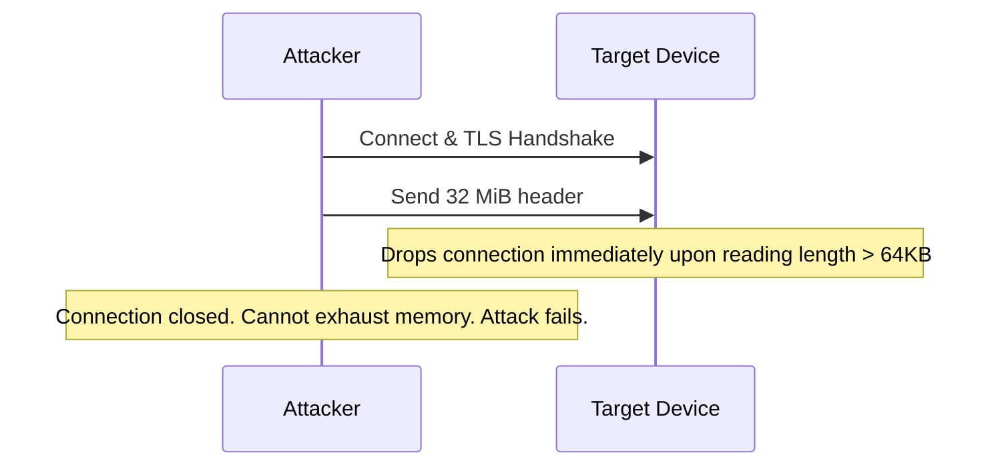

# 4. Medium. Denial of Service via Large Payloads

## Description
Section 1 defines the framing as a 4-byte length prefix followed by a JSON object, with a maximum encoded size of 32 MiB.
While setting a limit is good practice, 32 MiB is extremely large for a single JSON string, especially when parsed into memory (and potentially decoding base64 data, as in the case of clipboard contents). An unauthenticated attacker (who only needs to discover the service and establish a basic, provisional TLS connection—perhaps using a self-signed certificate before PoP verification) could repeatedly send 32 MiB frames containing junk JSON or massive strings. This could exhaust the memory of the daemon (especially on resource-constrained Android devices running the Dart daemon), leading to an Out-Of-Memory (OOM) crash and a Denial of Service (DoS).

## Diagram of the vulnerable design

## Diagram of the attacker's side

## The fix
1. Implement variable payload limits based on the authentication state. Before the peer is fully authenticated (i.e., before a valid `session.hello` and PoP verification), the maximum frame size MUST be strictly limited to a small value (e.g., 64 KiB), which is more than enough for session negotiation messages.
2. The 32 MiB limit should ONLY be allowed for specific message types (like `clipboard.fetchResponse`) from fully authenticated and trusted peers.

## Diagram of the fixed design

## Diagram of the attacker's side with the new design

