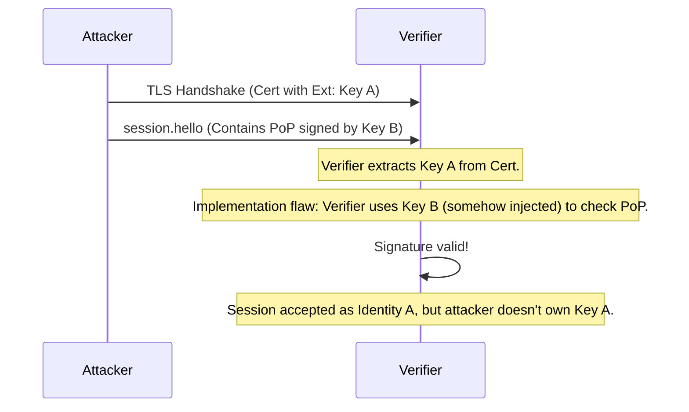
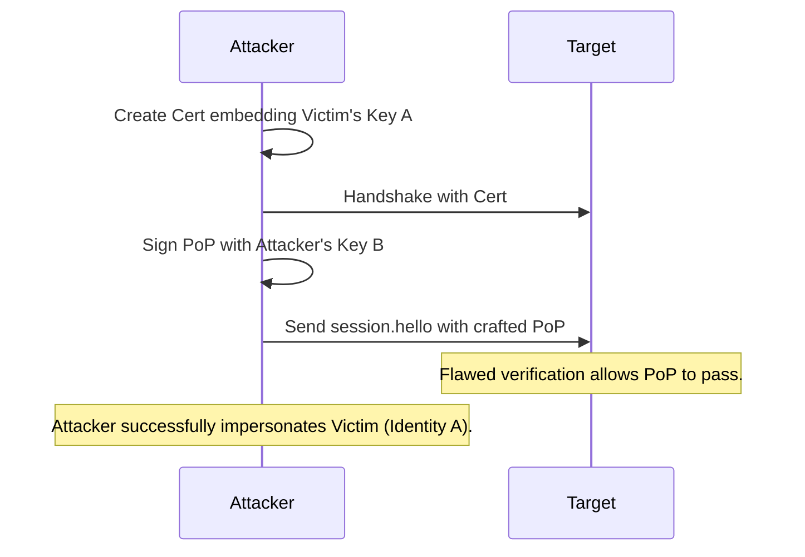
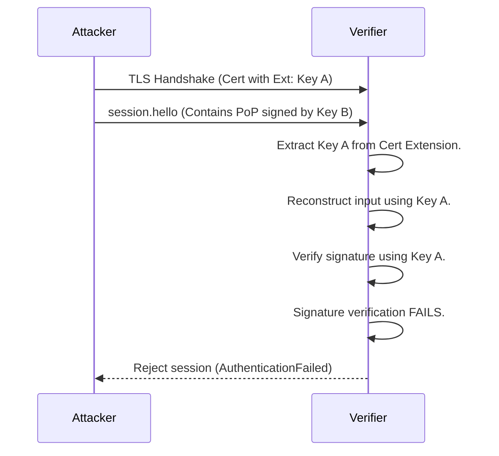
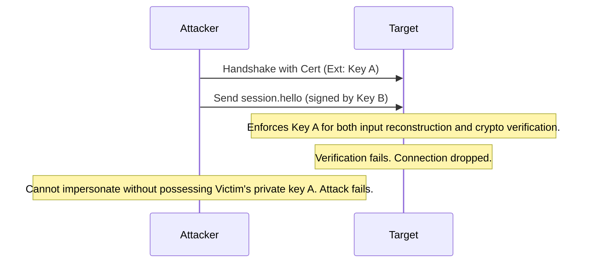

# 6. Critical. Identity Misbinding via Missing Key Validation in PoP

## Description
Section 5.3 describes the Ed25519 Proof of Possession. The signing input concatenates `RiftPoP-v2:`, the TLS channel binding, the signer's Ed25519 public key, and the SHA-256 hash of the signer's ECDSA certificate.
However, the specification does not explicitly mandate that the verifier MUST check that the "signer's Ed25519 public key" included in the reconstructed signing input (step 4 of Section 5.3.2) is *mathematically* the same key that was extracted from the custom X.509 extension of the presented certificate. 
If an implementation extracts public key A from the certificate extension, but uses an attacker-supplied public key B (perhaps supplied in the `session.hello` payload itself, though not currently specified, or through parsing ambiguities) to verify the signature, the attacker could forge the Proof of Possession. The verifier would successfully verify the signature using key B, but associate the session with identity A.

## Diagram of the vulnerable design

## Diagram of the attacker's side

## The fix
Section 5.3.2 MUST explicitly state: "The verifier MUST use the exact 32 bytes extracted from the peer's custom X.509 certificate extension as the 'signer's Ed25519 public key' when reconstructing the expected signing input AND when performing the Ed25519 signature verification algorithm. The implementation MUST NOT accept or use any alternative public key provided in the message payload or envelope for this verification."
Furthermore, add a test vector specifically asserting that if the public key used to generate the PoP signature does not perfectly match the raw bytes in the certificate extension, the verification must fail.

## Diagram of the fixed design

## Diagram of the attacker's side with the new design

