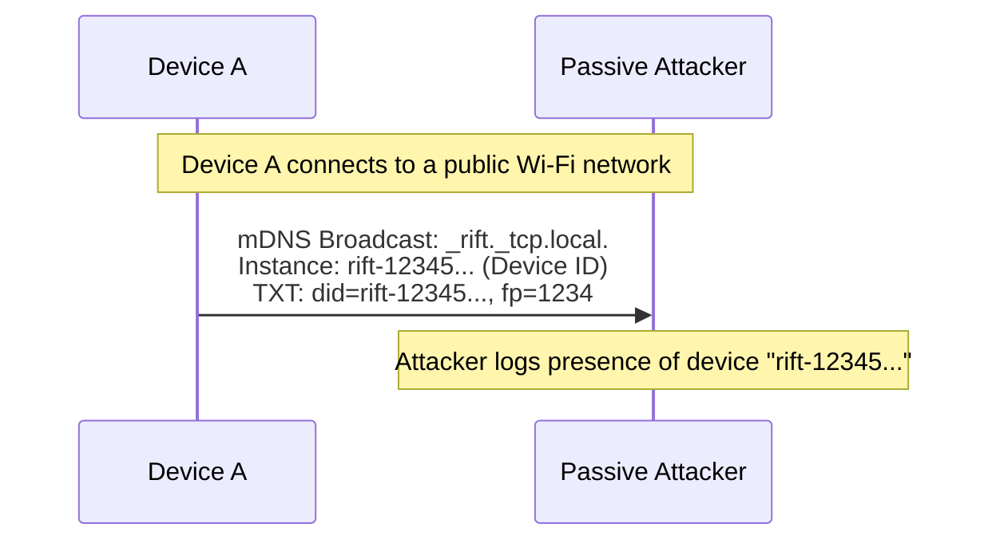
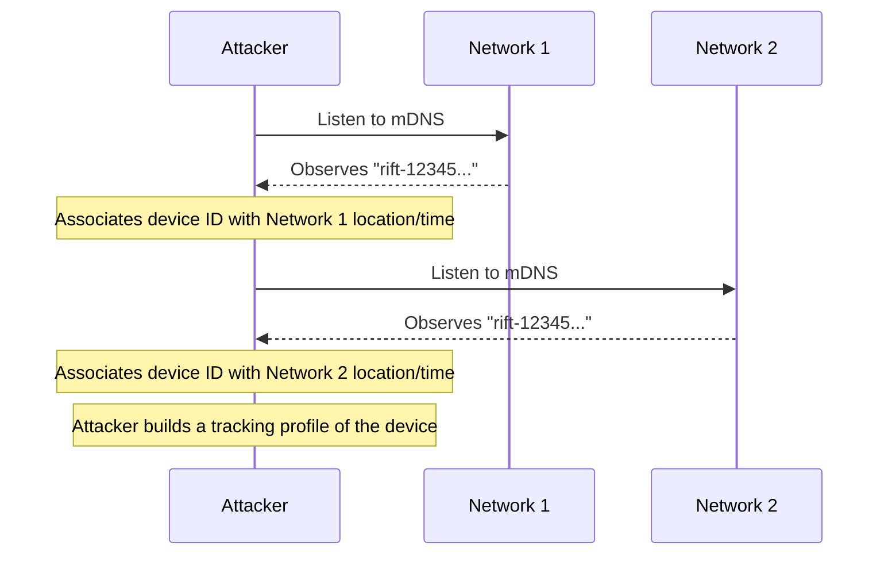
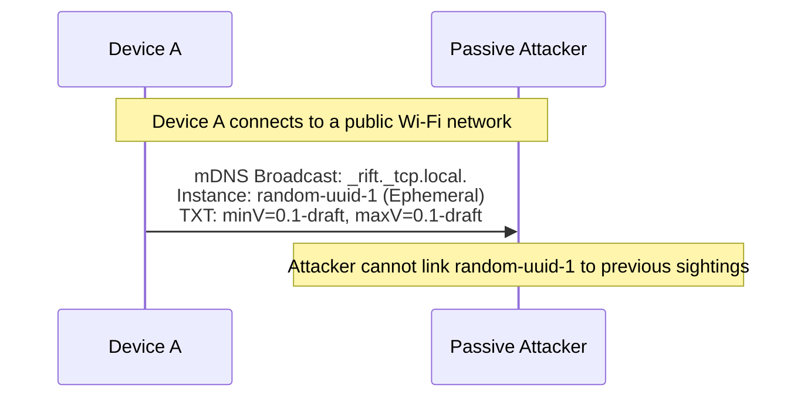
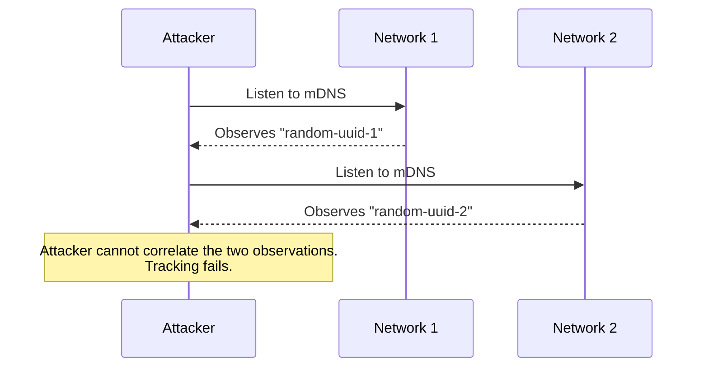

# 1. Medium. mDNS Identity Tracking

## Description
The protocol specification (Section 4.1) allows implementations to optionally use the `deviceId` (derived from the public key hash) as the mDNS service instance name, and (Section 4.2) allows advertising `did` (device ID) and `fp` (fingerprint prefix) in the TXT record. Although it correctly advises against this to limit pre-authentication identity disclosure, allowing it at all creates a privacy vulnerability. 
If an implementation chooses to include these stable identifiers in mDNS broadcasts, any passive listener on the local network can persistently track the presence and movements of the device across different networks without ever authenticating or interacting with it. The `deviceId` is derived from the permanent Ed25519 public key and does not rotate.

## Diagram of the vulnerable design

## Diagram of the attacker's side

## The fix
Do not allow the use of stable identifiers like `deviceId` or `fingerprint` in unauthenticated mDNS broadcasts, even as optional features. 
1. The mDNS instance name MUST be a randomly generated, opaque identifier that is rotated periodically or at least upon every network interface change (e.g., reconnecting to Wi-Fi).
2. Remove the `did` and `fp` fields from the allowed mDNS TXT record schema entirely.
If a user needs explicit peer recognition before connection, this should be handled at the application layer after a provisional TLS connection is established, or by using short-lived, rotating discovery tokens.

## Diagram of the fixed design

## Diagram of the attacker's side with the new design

