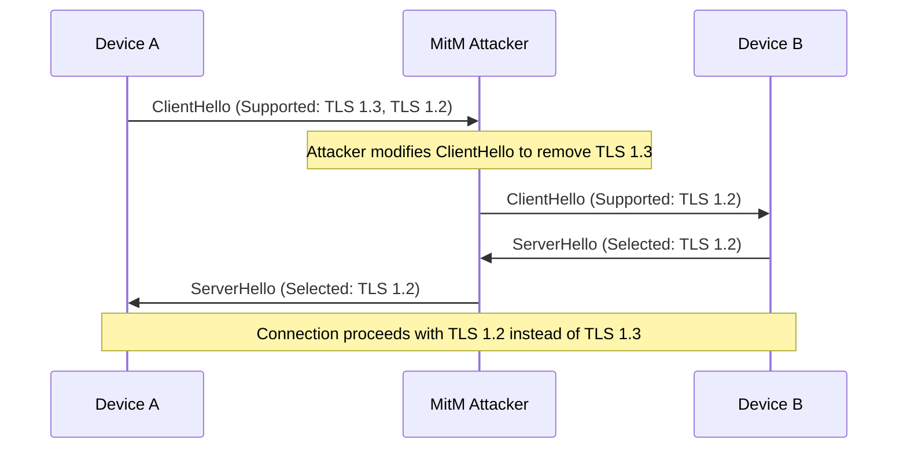
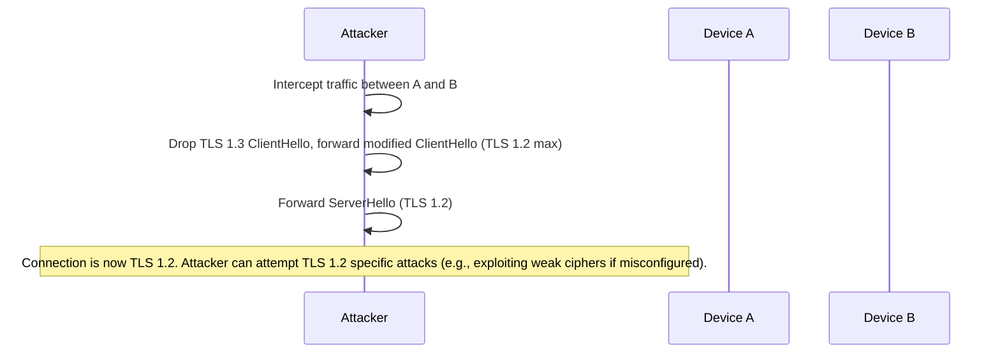
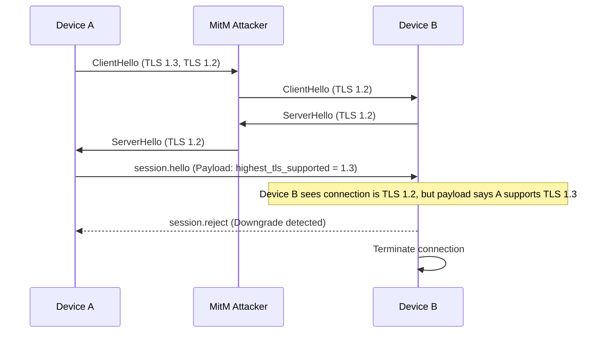
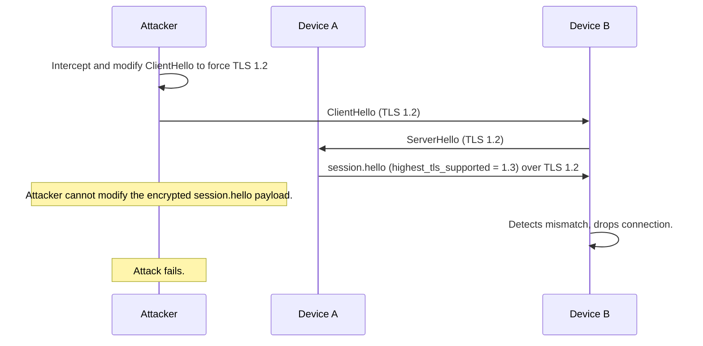

# 2. High. TLS Downgrade Attack

## Description
The protocol specification (Section 5.1 and ADR 0002) allows a fallback to TLS 1.2 if TLS 1.3 is unavailable, noting that "Dart's SecurityContext does not expose a minimum protocol version setter". However, allowing TLS 1.2 negotiation introduces the risk of downgrade attacks where an active Man-in-the-Middle (MitM) attacker can alter the handshake messages to force both peers to negotiate TLS 1.2 even if both support TLS 1.3. 
While Section 5.3.4 mitigates the Triple Handshake Attack by requiring the Extended Master Secret (EMS) for TLS 1.2, it does not prevent the downgrade itself. TLS 1.2 lacks some of the robust downgrade protections and forward secrecy guarantees that are mandatory in TLS 1.3. If weak ciphers are accidentally supported or a vulnerability is found in TLS 1.2, the downgrade attack opens the door to exploitation.

## Diagram of the vulnerable design

## Diagram of the attacker's side

## The fix
If TLS 1.3 minimum enforcement is impossible via Dart's API, the protocol must implement application-layer downgrade detection. 
In the `session.hello` message (the first encrypted message), peers should exchange the highest TLS version they actually support. If a peer receives `session.hello` over a TLS 1.2 connection, but the `session.hello` payload indicates the sender supports TLS 1.3, it proves a downgrade attack occurred. The connection MUST be immediately terminated with `ProtocolError` or `AuthenticationFailed`.

## Diagram of the fixed design

## Diagram of the attacker's side with the new design

