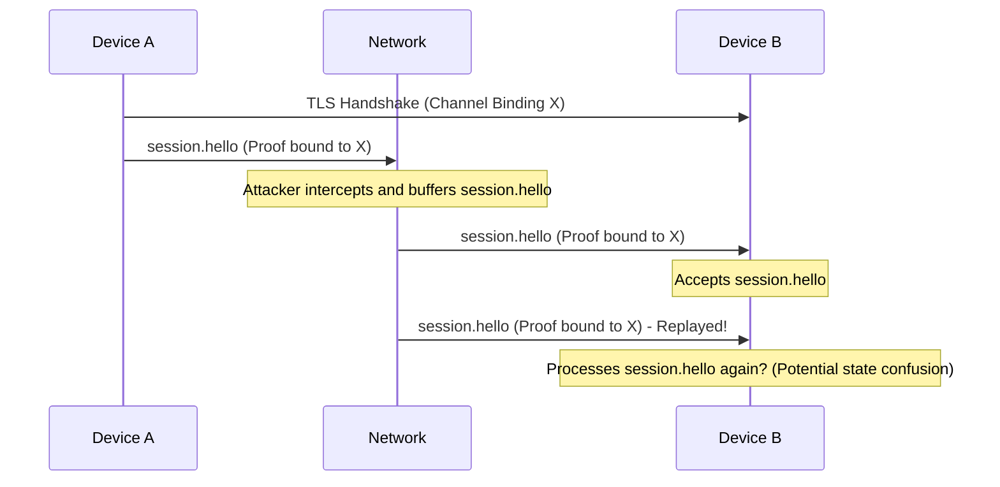
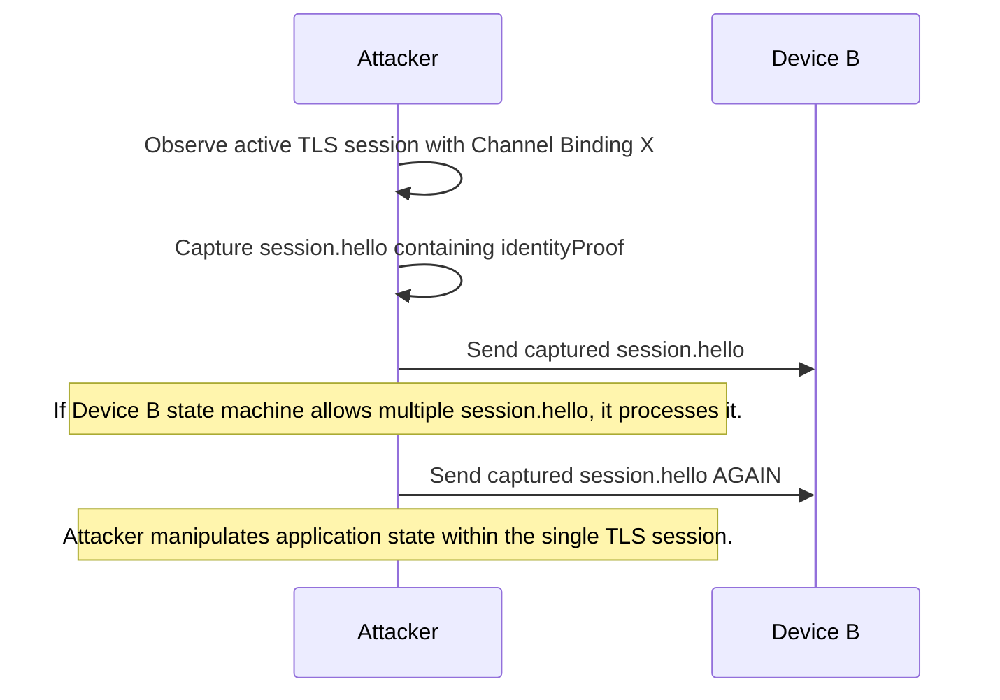
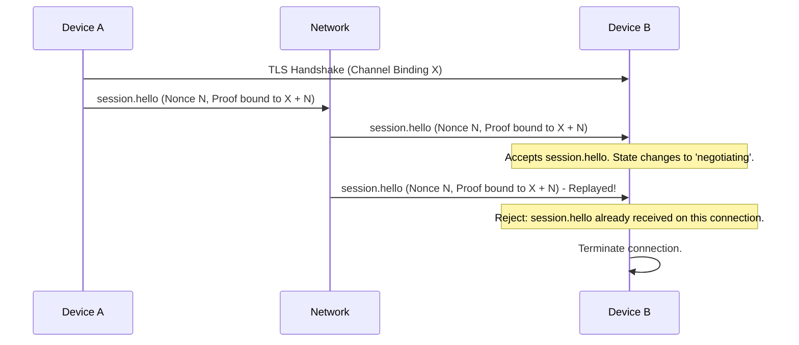
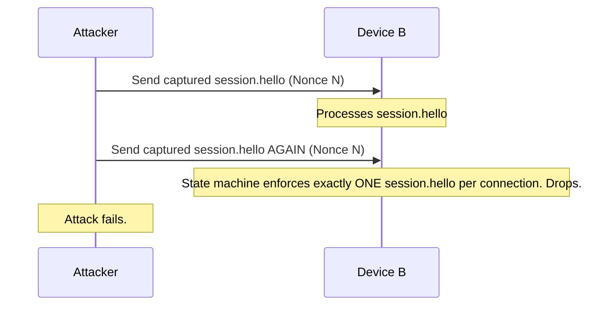

# 3. High. Replay Attack on session.hello

## Description
Section 5.3 describes the Ed25519 Proof of Possession (PoP) to bind the device identity to the TLS session. The signing input is constructed by concatenating the prefix `RiftPoP-v2:`, the TLS channel binding (`tls-exporter` or `tls-unique`), the signer's Ed25519 public key, and the SHA-256 hash of the signer's ECDSA certificate.
While this strongly binds the signature to the specific TLS channel and the certificate, it lacks a mechanism to guarantee the freshness of the `session.hello` message *within* that specific TLS session. Although the TLS channel binding changes per TLS session (preventing cross-session replay), an attacker who can inject data into an active TLS stream (or if the application logic allows processing multiple `session.hello` messages on the same connection) could potentially replay the `session.hello` message *within the same TLS session*. 
More critically, if a peer connects, completes the TLS handshake, sends a valid `session.hello` (which the attacker intercepts and buffers), and the attacker later forwards this exact same `session.hello` (while keeping the TLS session alive), the application might process it multiple times or out of order.

## Diagram of the vulnerable design

## Diagram of the attacker's side

## The fix
1. The protocol state machine MUST explicitly reject multiple `session.hello` messages on the same TLS connection. Once a `session.hello` is processed, any subsequent `session.hello` on that connection MUST result in immediate termination of the session with a `ProtocolError`.
2. Add a strong nonce (e.g., a randomly generated UUID) to the `session.hello` payload and include this nonce in the signed `identityProof` input. This guarantees the freshness of the signature beyond just the TLS channel binding.

## Diagram of the fixed design

## Diagram of the attacker's side with the new design

