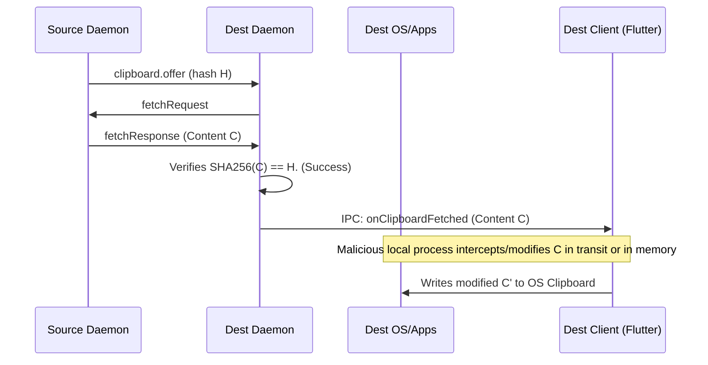
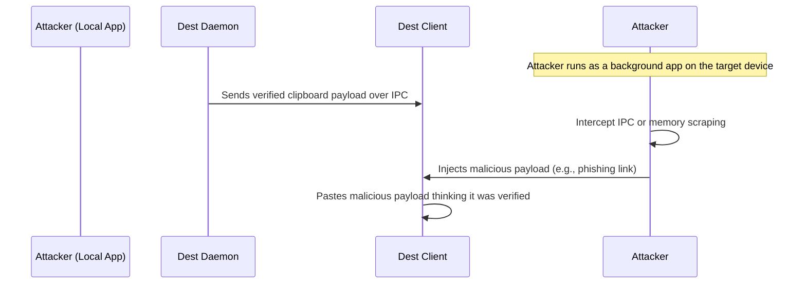
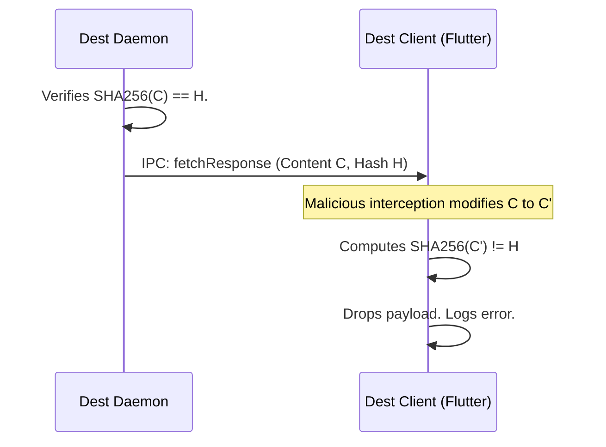
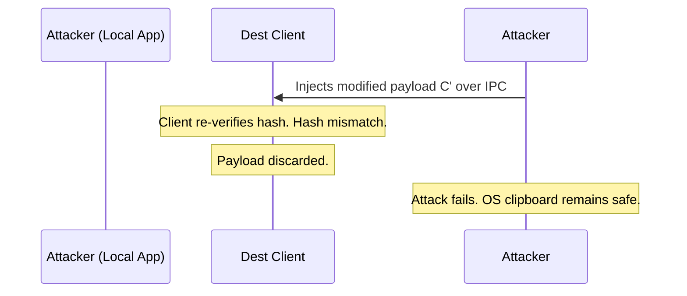

# 5. High. Time-of-Check to Time-of-Use (TOCTOU) in Clipboard Fetch

## Description
Section 11 describes the clipboard continuity. A peer broadcasts a metadata offer (`clipboard.offer`), and a trusted peer can later request the content via `clipboard.fetchRequest`. The fetched content is verified against the `byteSize` and `sha256` hash provided in the original offer.
However, there is a race condition or TOCTOU vulnerability if the IPC interaction between the local daemon and the local Flutter client is not carefully synchronized. If the daemon fetches the content, verifies the hash, and then stores it temporarily (or sends it via IPC to the client), a compromised or malicious local app on the destination device (or an attacker who can manipulate the pipe/socket if OS permissions allow) might intercept or alter the clipboard data *after* the daemon verifies it but *before* the Flutter client pastes it to the OS clipboard. 
While the protocol specifies hash verification upon receipt by the daemon, it does not mandate end-to-end verification up to the point of application consumption.

## Diagram of the vulnerable design

## Diagram of the attacker's side

## The fix
End-to-end verification must be extended to the client application.
1. The `clipboard.fetchResponse` IPC message from the daemon to the Flutter client MUST include the original `sha256` hash.
2. The Flutter client MUST independently compute the SHA-256 hash of the received IPC payload immediately before writing it to the OS clipboard and verify that it matches the expected hash. If it does not match, the payload MUST be discarded and an error logged.

## Diagram of the fixed design

## Diagram of the attacker's side with the new design

