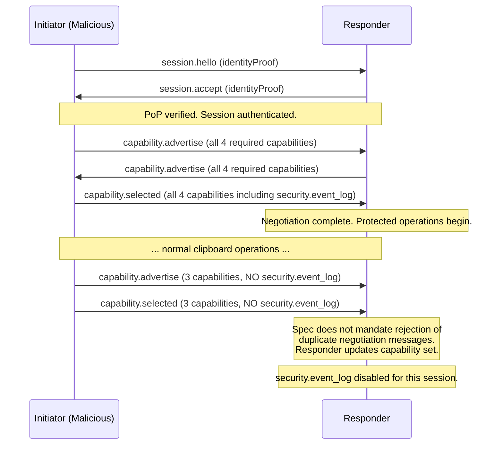
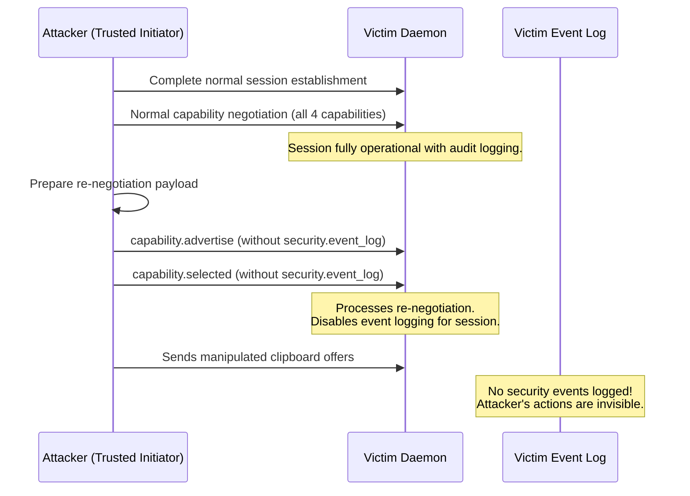
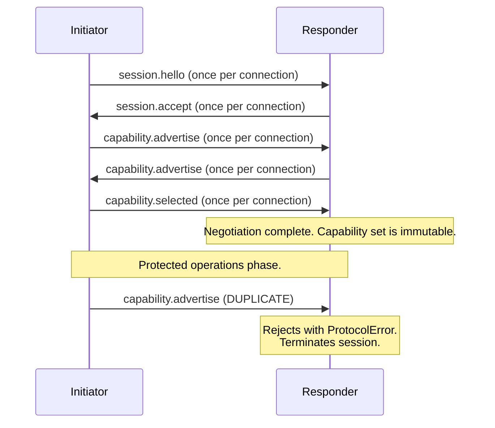
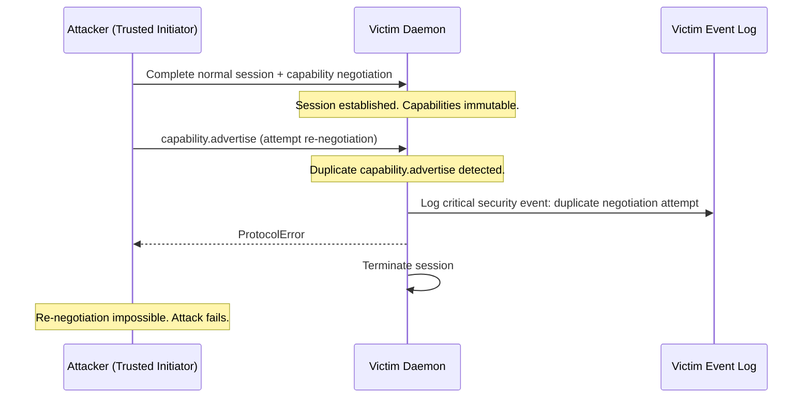

# Capability Re-Negotiation via Duplicate Negotiation Messages

## Description

Section 6 explicitly enforces a one-per-connection limit for `session.hello`: "Each TLS connection MUST process at most one `session.hello` message in each direction. If a peer sends a second `session.hello` on the same connection, the receiver MUST reject it with `ProtocolError` and terminate the session."

However, this singularity enforcement is **not applied** to the other session-phase-critical messages: `session.accept`, `capability.advertise`, and `capability.selected`. Section 9.2 defines the capability negotiation flow (advertise → selected → validate) but does not state that this negotiation may only occur once per connection, nor does it require the receiver to reject duplicate negotiation messages.

A malicious but trusted peer (the session initiator) could exploit this gap by sending a second `capability.selected` message mid-session after protected operations have begun. If the responder's implementation processes this second message and updates its negotiated capability set, the attacker could:

1. **Remove `security.event_log`** from the selected set, suppressing audit logging of subsequent malicious actions within the session.
2. **Remove `operation.lifecycle`** to prevent the responder from tracking operation state, masking operation manipulation.
3. **Downgrade capability versions** to force the responder to use older, potentially less secure capability behavior in future protocol versions.

Because the spec explicitly protects `session.hello` against duplicates but is silent on all other phase messages, implementations may reasonably assume that only `session.hello` needs this protection, leaving the capability negotiation phase unguarded.

## Diagram of the design part where it's vulnerable

## Diagram of the attacker's side

## The fix

Extend the one-per-connection singularity enforcement from `session.hello` to ALL session establishment phase messages. Add the following to Section 9.2:

"Each TLS connection MUST process at most one `capability.advertise` message in each direction and at most one `capability.selected` message from the initiator. If a peer sends a duplicate `capability.advertise` or `capability.selected` on the same connection, the receiver MUST reject it with `ProtocolError` and terminate the session. Similarly, each TLS connection MUST process at most one `session.accept` message. These constraints, combined with the existing `session.hello` singularity rule (Section 6), ensure that session establishment is a one-time forward-only sequence that cannot be replayed or re-negotiated within a connection."

## Diagram of the fixed design part

## Diagram of the attacker's side with the new design

