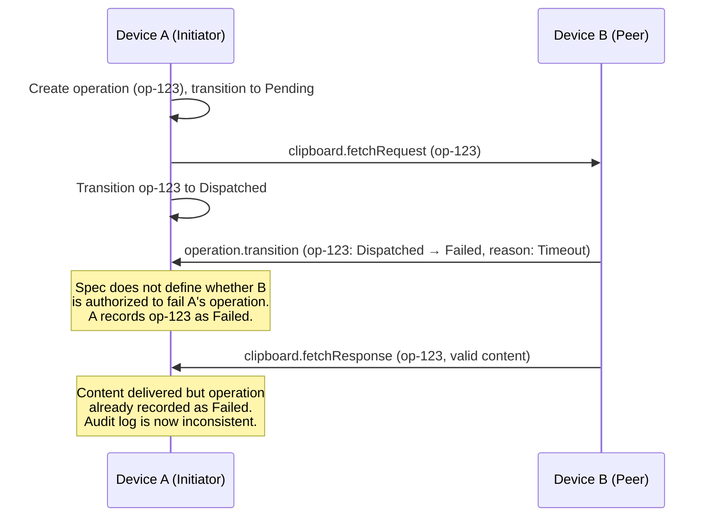
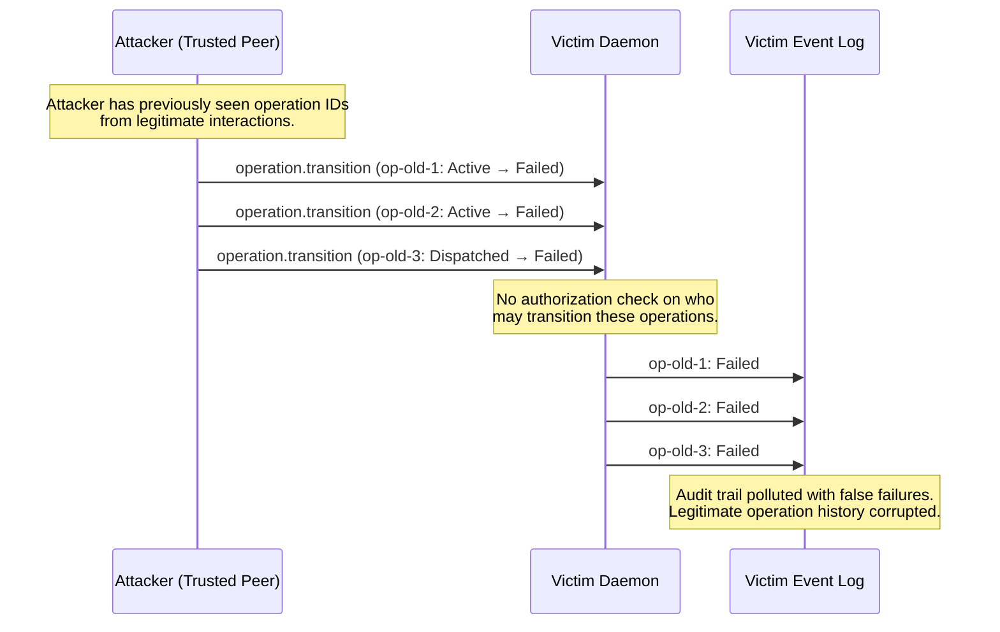
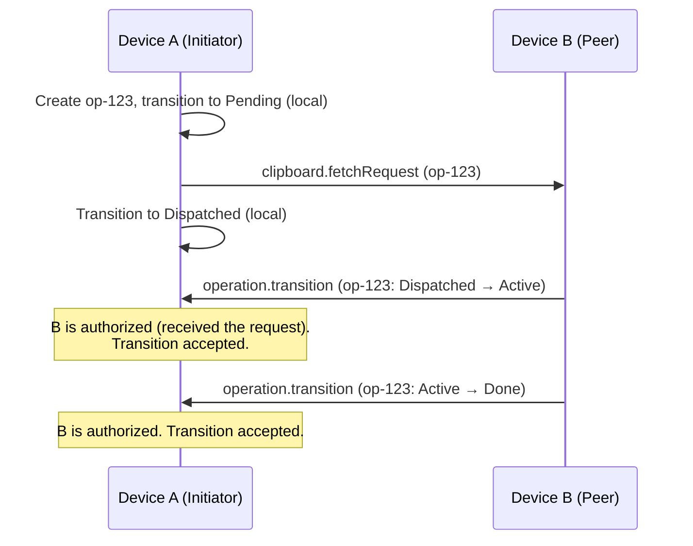
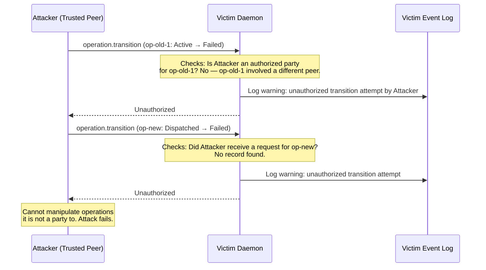

# Operation Transition Authorization Gap

## Description

Section 10 defines the operation lifecycle state machine with transitions from `Created` through `Pending`, `Dispatched`, `Active`, to terminal states (`Done`, `Failed`, `Expired`). Section 7.6 defines the `operation.transition` message with fields `operationId`, `operationType`, `previousState`, `nextState`, optional `failureReason`, and optional `details`.

However, the specification **does not define an authorization model** for who may trigger which transitions. In a two-party operation (e.g., clipboard fetch between Device A and Device B), the spec does not specify:

1. Which device is authorized to transition the operation from `Dispatched` to `Active`.
2. Which device is authorized to transition the operation to terminal states (`Done`, `Failed`).
3. Whether both peers or only the operation owner may report transitions.

Without an authorization model, a malicious trusted peer can send `operation.transition` messages to falsely advance or abort operations they do not control. For example, a malicious Device B that receives a `clipboard.fetchRequest` from Device A could send `operation.transition` marking the operation as `Failed` (with a misleading `failureReason`) while simultaneously sending a valid `clipboard.fetchResponse`. Device A's daemon would record the operation as failed in the audit log even though the content was delivered, creating inconsistent state that obscures the attacker's behavior.

More critically, a malicious peer could send unsolicited `operation.transition` messages for operation IDs it learned from previous legitimate interactions, retroactively marking operations as `Failed` to pollute the audit trail, or marking new operations as `Done` prematurely before the actual work completes.

## Diagram of the design part where it's vulnerable

## Diagram of the attacker's side

## The fix

Add an authorization model to Section 10 that defines which peer may trigger which transitions. Each transition should have an authorized role:

1. `Created → Pending`: Local only (the operation creator). Not triggered by peer messages.
2. `Pending → Dispatched`: Local only (upon sending the request message to the peer).
3. `Dispatched → Active`: **Remote peer only** (the peer that received the request and began processing).
4. `Active → Done`: **Remote peer only** (the peer that completed the work).
5. `Any → Failed`: Either peer, but with scoped authorization — the initiator may fail its own operations, and the remote peer may only fail operations for which it received a request on the current session.
6. `Any → Expired`: Local only (based on monotonic timer expiry).

Additionally, the spec should state: "Implementations MUST reject `operation.transition` messages from a peer that is not an authorized party for the referenced operation. An `operation.transition` referencing an unknown `operationId` or one for which the sending peer has no authorization MUST be rejected with `Unauthorized` and logged as a `warning` security event."

## Diagram of the fixed design part

## Diagram of the attacker's side with the new design

