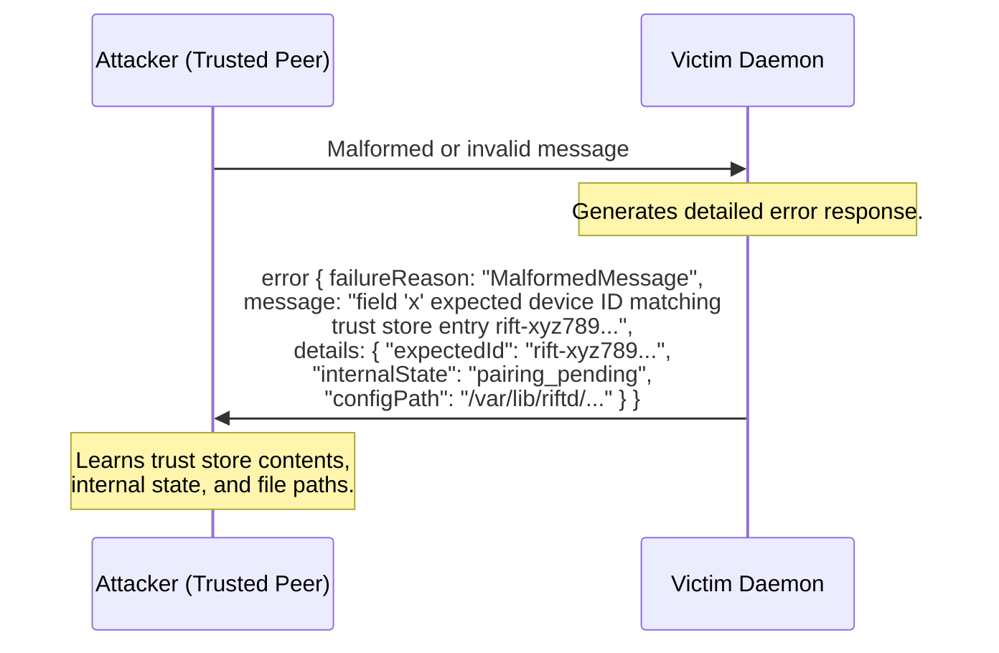
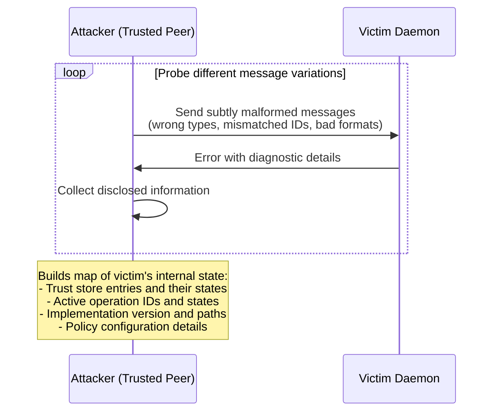
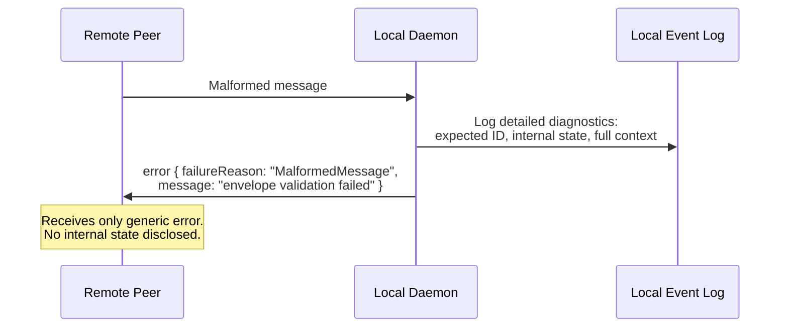
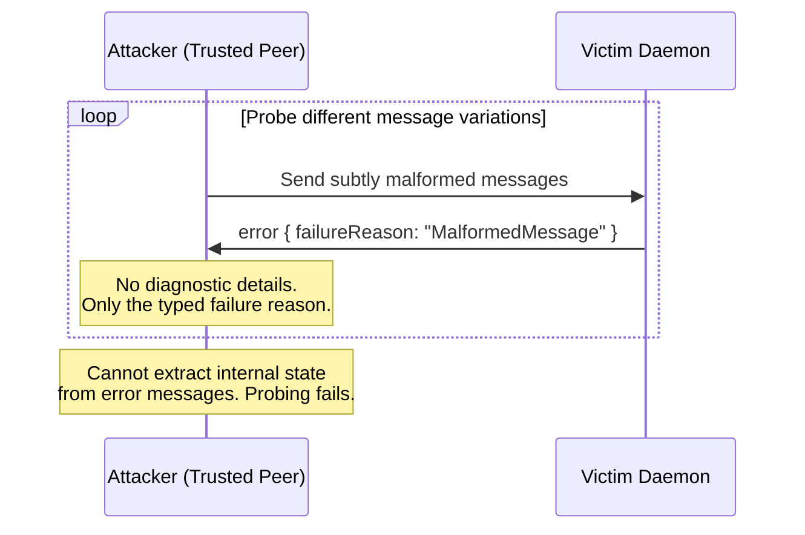

# Peer Protocol Error Message Information Disclosure

## Description

The IPC specification (ipc.md, Section 3) explicitly restricts the content of error messages sent to the local client: "The `data` field of an error object MAY contain additional diagnostic information. It MUST NOT contain private keys or clipboard content."

However, the peer protocol specification (protocol.md, Section 7.8) defines error messages with `failureReason`, optional `refMessageId`, optional `message` string, and optional `details` object — but imposes **no content restrictions** on the `message` or `details` fields for error messages sent to remote peers.

This asymmetry means that while the daemon correctly protects the local IPC boundary from information leakage, it has no normative guidance preventing implementations from including sensitive diagnostic information in error messages sent to potentially malicious remote peers. An implementation that includes detailed diagnostics in peer-facing error messages could inadvertently disclose:

1. **Internal trust store state** — e.g., "expected device rift-abc123 but identity maps to rift-def456" reveals which device IDs are in the trust store.
2. **Internal file paths or configuration** — e.g., stack traces or file paths in error details reveal implementation structure useful for targeted attacks.
3. **Timing or state information** — e.g., "operation op-123 is already in state Active" reveals internal operation state that the peer should not be able to query directly.
4. **Capability or policy details** — e.g., "policy flag X required for capability Y" reveals the local policy configuration.

While the `failureReason` field is constrained to the closed vocabulary in Section 14 (preventing invention of new peer-visible reasons), the free-form `message` and `details` fields have no equivalent constraint.

## Diagram of the design part where it's vulnerable

## Diagram of the attacker's side

## The fix

Add the following normative requirement to Section 7.8:

"The `message` and `details` fields in error messages sent to remote peers MUST NOT contain: private keys, clipboard content, trust store entries or state, internal file paths, stack traces, configuration details, or any information not already known to the receiving peer through normal protocol operation. Implementations SHOULD prefer terse, generic error messages for peer-facing errors and reserve detailed diagnostics for the local security event log (Section 13). The `failureReason` from Section 14 is the primary error signal; `message` and `details` are supplementary and MUST be treated as potentially attacker-visible."

This mirrors the existing IPC-layer restriction and extends it to cover the peer protocol boundary.

## Diagram of the fixed design part

## Diagram of the attacker's side with the new design

