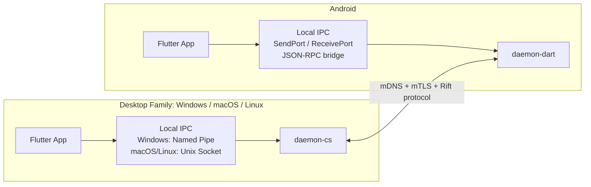
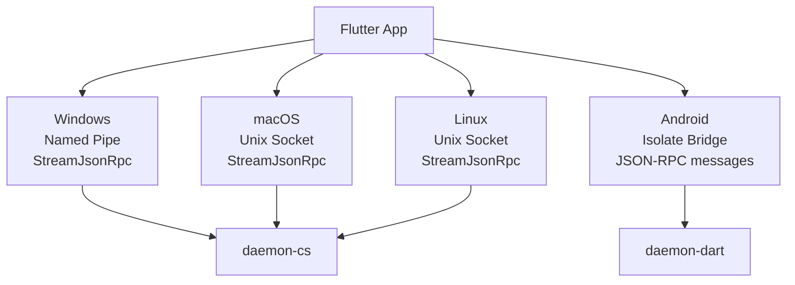
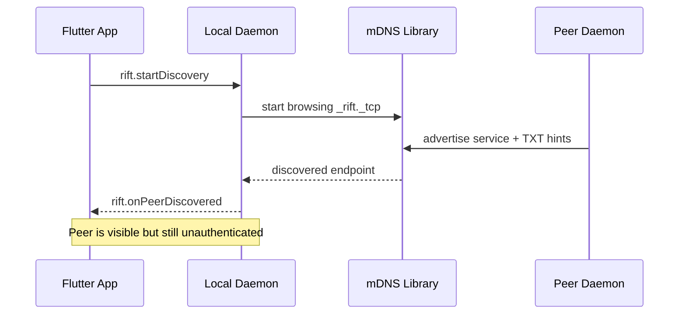
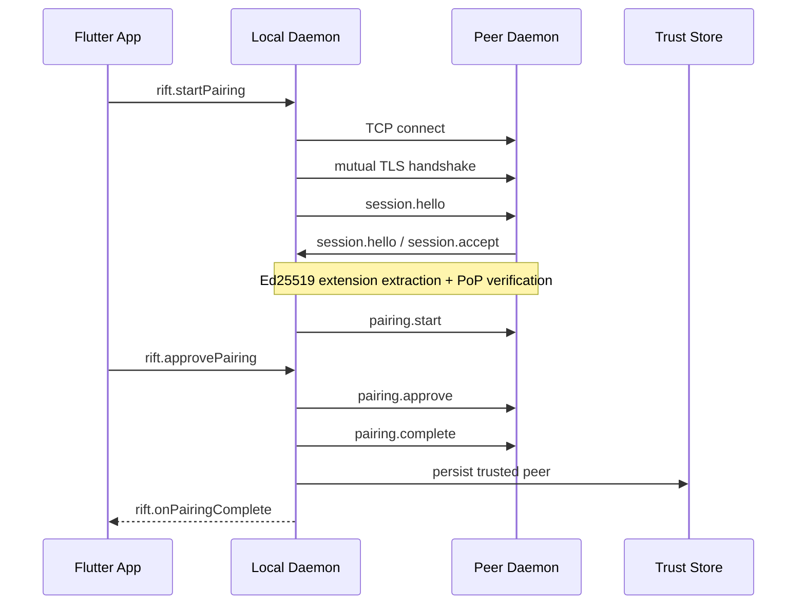
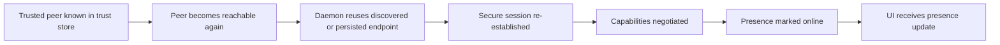
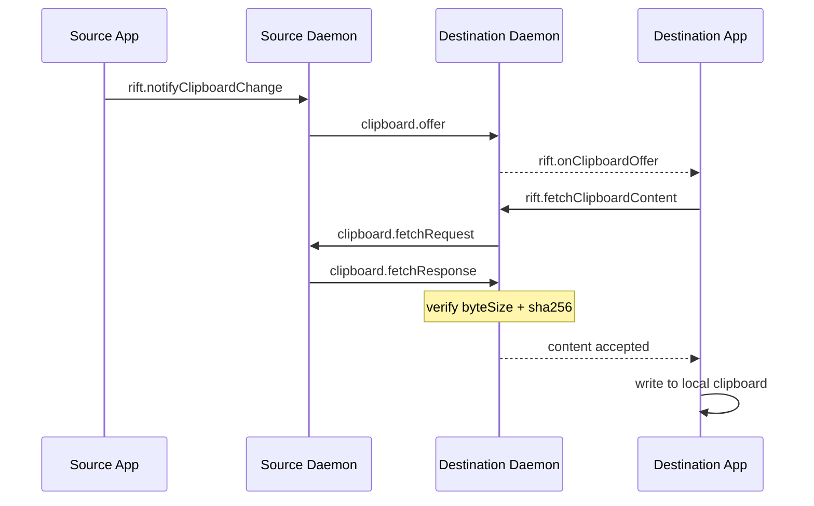
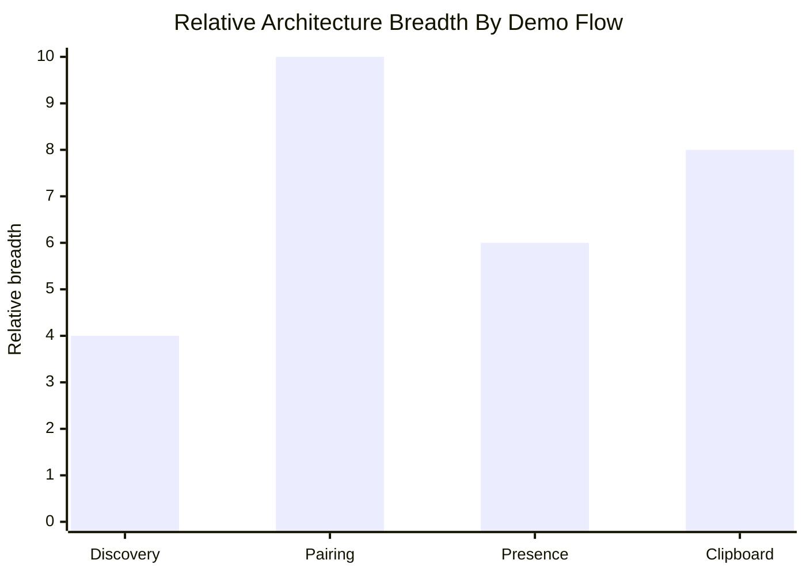

# Rift Demo Flow Architecture

## Purpose

This document explains the main Rift demo flows for architecture-focused review.
It answers three questions:

1. How the main project flows work end to end
2. How the key libraries are called during those flows
3. Which demo flow combines the most libraries

Rift is a protocol-first project. The source of truth is the written protocol in
`spec/doc/protocol.md` and the local app/daemon IPC contract in
`spec/doc/ipc.md`. The implementations in this repository are expected to match
those documents.

For the review, the clearest primary demo is `Windows + Android` because it
shows the two independent daemon implementations interoperating:

- `daemon-cs` for `Windows`, `macOS`, and `Linux`
- `daemon-dart` for `Android`

`macOS` and `Linux` are still part of the architecture story. They are included
below as desktop variants of the same C# daemon family.

## Architecture Overview Diagram

## Platform Map

| Platform | App | Daemon | Local IPC | Service / Runtime Host | Notes |
| --- | --- | --- | --- | --- | --- |
| Windows | Flutter | `daemon-cs` | Named pipes via `StreamJsonRpc` | Windows Service or console host | Main desktop review target |
| macOS | Flutter | `daemon-cs` | Unix domain socket via `StreamJsonRpc` | launchd LaunchAgent or console host | Shares the same core C# daemon logic |
| Linux | Flutter | `daemon-cs` | Unix domain socket via `StreamJsonRpc` | systemd service or console host | Shares the same core C# daemon logic |
| Android | Flutter | `daemon-dart` | Background isolate bridge, JSON-RPC over `SendPort` / `ReceivePort` | Android foreground/background daemon isolate | Uses the independent Dart daemon |

Important architectural point:

- The peer-to-peer protocol is **not** JSON-RPC.
- JSON-RPC is used only between the Flutter app and the local daemon.
- Between daemons, Rift uses mDNS discovery, mutual TLS, framed JSON messages,
  capability negotiation, pairing, presence, and clipboard offer/fetch.

## Platform Matrix Diagram

## System View In The Demo

The review demo can be understood as two layers running at the same time.

### Layer 1: Local app-to-daemon control plane

The Flutter app talks to the local daemon using JSON-RPC 2.0:

- On `Windows`, the app uses a named pipe transport and the C# daemon exposes
  methods through `StreamJsonRpc`
- On `macOS` and `Linux`, the app uses Unix domain sockets and the same
  `StreamJsonRpc` handler model
- On `Android`, the app starts the Dart daemon in a background isolate and
  exchanges JSON-RPC messages through a `SendPort` / `ReceivePort` bridge

This layer is used for commands such as:

- `rift.startDiscovery`
- `rift.startPairing`
- `rift.approvePairing`
- `rift.notifyClipboardChange`
- `rift.listClipboardOffers`
- `rift.fetchClipboardContent`

### Layer 2: Peer-to-peer continuity protocol

Once discovery finds a candidate peer, the daemons communicate directly over the
network:

- discovery by mDNS-SD
- secure channel by mutual TLS
- Ed25519 identity extraction from the custom certificate extension
- Proof of Possession verification
- capability negotiation
- pairing and trust-state transition
- clipboard metadata offer and authenticated fetch

This is the actual continuity protocol that the two implementations must share.

## Main Flows

## 1. Discovery Flow

### What the audience sees

The user opens the app and starts discovery. Nearby devices appear in the UI as
candidate peers.

### Protocol meaning

Discovery is only a **candidate-finding** step. It is unauthenticated and must
be treated as provisional. It only tells the daemon:

- there is a peer advertising `_rift._tcp`
- the peer claims a reachable local endpoint
- the peer advertises version hints such as `minV` and `maxV`

It does **not** establish trust.

### End-to-end sequence

1. The Flutter app calls `rift.startDiscovery` on the local daemon.
2. The local daemon starts browsing for `_rift._tcp` services.
3. The daemon receives mDNS announcements and converts them into discovered peer
   records.
4. The daemon notifies the Flutter app about discovered peers through local
   JSON-RPC notifications.
5. The UI shows peers as `discovered`, not `trusted`.

### Discovery Sequence Diagram

### Libraries involved

#### Desktop (`daemon-cs`)

- `StreamJsonRpc`
  - used for the local `rift.startDiscovery` request from Flutter to daemon
  - used again to send discovery notifications back to Flutter
- `Makaretu.Dns.Multicast`
  - starts mDNS advertisement and browsing
  - handles `_rift._tcp` service announcements and TXT records
- `.NET networking`
  - used for the UDP fallback discovery path in offline/local-only cases

#### Android (`daemon-dart`)

- Flutter isolate bridge + local JSON-RPC messages
  - the app requests discovery through the Android daemon transport
- `nsd`
  - registers and discovers `_rift._tcp` services on Android
- Dart `RawDatagramSocket`
  - provides a UDP fallback discovery path when mDNS is insufficient

### How the libraries work together

- The app-side transport starts the flow through JSON-RPC.
- The daemon-side discovery library (`Makaretu` or `nsd`) watches the local
  network.
- The daemon normalizes discovery results into a shared peer model.
- JSON-RPC sends those results back to the UI.

### Architectural takeaway

Discovery is the simplest visible flow, but it already shows a full stack:

- Flutter UI
- local IPC
- discovery library
- daemon state tracking
- UI notification path

It is still not the security-critical flow because trust has not been granted.

## 2. Pairing Flow

### What the audience sees

The user selects a discovered device, sees local and peer fingerprints, confirms
that they match on both devices, and the peer moves from `discovered` or
`pairing_pending` to `trusted`.

### Protocol meaning

Pairing is the security-critical flow. It is where Rift turns a provisional
discovered endpoint into an authenticated and trusted peer.

This flow includes:

- connecting to the peer endpoint
- mutual TLS handshake
- extracting the Ed25519 key from the custom X.509 extension
- deriving device ID and fingerprint locally
- verifying Ed25519 Proof of Possession
- exchanging pairing messages
- persisting trust in the trust store

### End-to-end sequence

1. The Flutter app calls `rift.startPairing` or `rift.startPairingByEndpoint`.
2. The local daemon resolves the target peer from discovery or a manual endpoint.
3. The initiating daemon opens a TLS connection to the peer daemon.
4. Both sides complete mutual TLS using self-signed P-256 certificates.
5. Each side extracts the embedded Ed25519 public key from the peer
   certificate.
6. Each side derives the canonical device ID and fingerprint from that
   authenticated Ed25519 key.
7. Both sides exchange `session.hello` and `session.accept`.
8. Both sides verify Ed25519 Proof of Possession against the TLS session /
   app-nonce binding.
9. Both sides negotiate capabilities.
10. The pairing flow sends `pairing.start`, `pairing.approve`, and
    `pairing.complete`.
11. The trust store persists the peer as `trusted`.
12. The local daemon sends JSON-RPC pairing-complete notifications back to the
    Flutter app.

### Pairing Sequence Diagram

### Libraries involved

#### Desktop (`daemon-cs`)

- `StreamJsonRpc`
  - carries `rift.startPairing`, `rift.approvePairing`, and notifications to UI
- `Makaretu.Dns.Multicast`
  - provides the initial discovered endpoint in the common path
- `.NET TcpClient` / `TcpListener`
  - opens the peer connection
- `.NET SslStream`
  - performs mutual TLS
- `Portable.BouncyCastle`
  - helps build and parse the custom certificate material
  - supports Ed25519 identity handling and custom X.509 extension work
- local cryptography + hash utilities
  - derive device IDs and fingerprints
  - validate Proof of Possession inputs
- `Microsoft.Data.Sqlite`
  - persists trust state and peer records

#### Android (`daemon-dart`)

- local JSON-RPC bridge over `SendPort` / `ReceivePort`
  - delivers `rift.startPairing` and `rift.approvePairing`
- `nsd`
  - provides the discovered endpoint if pairing starts from discovery
- Dart `Socket` / `SecureSocket`
  - performs the peer network connection and mutual TLS
- `PointyCastle` and related Dart crypto/cert code
  - supports key handling, fingerprint derivation, certificate processing, and
    PoP-related cryptographic operations
- custom certificate decoder
  - extracts the Ed25519 key from the custom certificate extension
- SQLite-backed trust store implementation
  - persists trust state transitions

### How the libraries work together

This is the best flow for demonstrating architectural understanding because many
subsystems are chained tightly together:

1. Discovery provides the candidate endpoint.
2. Local IPC carries the user’s pairing request into the daemon.
3. TLS transport authenticates the channel at the P-256 certificate layer.
4. The crypto layer extracts the embedded Ed25519 identity.
5. PoP verification proves the peer actually owns that Ed25519 identity.
6. Pairing messages complete the user confirmation step.
7. Persistence stores the resulting trust state.
8. JSON-RPC sends the result back to the UI.

### Architectural takeaway

Pairing is the most security-dense and library-dense flow in the demo. It is
the point where discovery, transport, cryptography, persistence, protocol
state, and UI confirmation all meet.

## 3. Presence And Trusted Reconnect Flow

### What the audience sees

After pairing, trusted peers appear online or offline, and the session can be
re-established without requiring a full new pairing flow.

### Protocol meaning

Presence is a post-authentication flow. It only becomes meaningful after:

- TLS session setup succeeds
- identity verification succeeds
- required capabilities are negotiated

The daemon can also reuse known trusted endpoints to reconnect to peers on the
local network.

### End-to-end sequence

1. A trusted peer becomes reachable on the local network.
2. The daemon establishes or re-establishes a secure session.
3. Session capability negotiation completes.
4. Presence state is tracked as `online`, `offline`, or `away`.
5. The daemon reports presence updates to the local Flutter app.

### Trusted Reconnect Diagram

### Libraries involved

- local JSON-RPC transport
  - delivers presence updates to the app
- mDNS libraries
  - help indicate that a known peer may be reachable again
- `SslStream` / `SecureSocket`
  - rebuild the authenticated session
- trust-store persistence
  - provides the known identity and trusted endpoint context

### How the libraries work together

Presence is less visually dramatic than pairing, but it proves that the pairing
result was durable. Trust is not just displayed in the UI; it changes future
network behavior by allowing reconnect and protected session traffic.

## 4. Clipboard Offer / Fetch Flow

### What the audience sees

The user copies content on one device. The other trusted device receives a
clipboard offer and can fetch the authenticated content. Clipboard sync works
only after trust has already been established.

### Protocol meaning

Rift does **not** immediately push clipboard content to every peer.

Instead, it uses a two-step model:

1. broadcast a metadata-only `clipboard.offer`
2. let a trusted peer request content with `clipboard.fetchRequest`
3. respond with `clipboard.fetchResponse`
4. verify `byteSize` and `sha256` before accepting the payload

This reduces unnecessary exposure of clipboard content and keeps clipboard
continuity inside the authenticated session model.

### End-to-end sequence

1. The user copies text on the source device.
2. The local app or platform clipboard hook detects the change.
3. The Flutter app sends `rift.notifyClipboardChange` to the local daemon.
4. The daemon validates the content size and SHA-256 hash.
5. The daemon sends `clipboard.offer` to trusted peers over the secure session.
6. The receiving daemon stores the remote offer and notifies its local app.
7. The receiving side calls `rift.fetchClipboardContent`.
8. The daemon sends `clipboard.fetchRequest` to the source peer.
9. The source daemon replies with `clipboard.fetchResponse`.
10. The receiving daemon verifies hash and size before accepting the content.
11. The receiving app writes the content into the local clipboard.

### Clipboard Sequence Diagram

### Libraries involved

#### App / platform side

- Flutter clipboard APIs and platform hooks
  - detect local clipboard changes
  - write fetched content into the local clipboard
- Android native clipboard glue
  - supports Android clipboard monitoring and send actions
- local JSON-RPC transport
  - sends `rift.notifyClipboardChange`
  - receives clipboard-offer notifications
  - requests `rift.fetchClipboardContent`

#### Daemon side

- `StreamJsonRpc` on desktop or JSON-RPC isolate bridge on Android
  - connects the app-side clipboard action to the daemon
- `SslStream` / `SecureSocket`
  - carries clipboard protocol messages between peers
- crypto hash utilities
  - compute and verify SHA-256
- trust store and capability state
  - ensure only trusted peers with the required capability can use the flow
- SQLite-backed persistence and event logging
  - store peer state and audit relevant failures

### How the libraries work together

Clipboard is a good demo because it shows both local-device and peer-device
coordination:

- local clipboard APIs detect a user action
- JSON-RPC forwards the action to the daemon
- the daemon converts it into a protocol-level clipboard offer
- secure transport carries the offer/fetch messages
- hashing validates integrity on receipt
- the local app writes the accepted content back to the OS clipboard

### Architectural takeaway

Clipboard demonstrates the value of the full stack, but it depends on pairing,
trust, and session setup already being complete. It is therefore slightly less
foundational than pairing.

## How The Main Libraries Work Together In The Demo

## mDNS libraries: `Makaretu.Dns.Multicast` and `nsd`

These libraries are responsible for local peer discovery and advertisement.

- They help devices notice each other on the LAN
- They provide provisional endpoint information
- They do not establish trust

In the demo, they are the first networking libraries to become active.

## Crypto libraries: `Portable.BouncyCastle`, `PointyCastle`, and supporting crypto code

These libraries and helpers are responsible for Rift’s identity model:

- Ed25519 long-term device identity
- ECDSA P-256 certificate generation
- custom X.509 extension handling
- fingerprint derivation
- Proof of Possession signing / verification support

In the demo, they are most visible during pairing.

## Local IPC libraries: `StreamJsonRpc` and JSON-RPC isolate bridging

These libraries connect the Flutter UI to the local daemon.

- Desktop uses `StreamJsonRpc` over named pipes or Unix sockets
- Android uses JSON-RPC message exchange over isolate ports

In the demo, they are used in every user-triggered action:

- start discovery
- start pairing
- approve pairing
- notify clipboard change
- fetch clipboard content

## Transport libraries: `.NET SslStream` and Dart `SecureSocket`

These implement the authenticated encrypted peer channel.

- they carry `session.hello` / `session.accept`
- they carry capability negotiation
- they carry pairing and clipboard messages

Without them, discovery would exist, but no secure peer flow could continue.

## Persistence libraries: `Microsoft.Data.Sqlite` and the Dart trust store storage

These store durable state:

- trusted peers
- blocked / revoked peers
- last known peer state
- security and audit information

They matter most after pairing, because they make trust survive beyond one
session.

## Clipboard and platform integration

These parts connect Rift to real operating-system behavior:

- Flutter clipboard read/write on desktop
- Android clipboard services and activities
- UI event handling around offer reception and content application

They make the protocol visible as an end-user continuity feature rather than
just a network protocol.

## Which Flow Uses The Most Libraries Combined?

The flow that uses the most libraries together is **Pairing**.

### Why pairing is the strongest answer

Pairing combines all of the following in one continuous path:

- local Flutter UI
- local JSON-RPC IPC
- discovery results from mDNS
- TCP connection setup
- TLS via `SslStream` or `SecureSocket`
- certificate generation / parsing support
- Ed25519 identity derivation
- fingerprint calculation
- Proof of Possession verification
- trust-state transition logic
- SQLite-backed persistence
- JSON-RPC notifications back to the UI

No other flow in the demo activates as many independent architectural layers at
once.

### Comparison summary

| Flow | Main libraries / subsystems involved | Relative complexity |
| --- | --- | --- |
| Discovery | JSON-RPC IPC, mDNS library, daemon state tracking, UI notifications | Low |
| Pairing | JSON-RPC IPC, mDNS, TCP, TLS, crypto libraries, cert parsing, PoP, trust store, persistence, UI notifications | Highest |
| Presence / trusted reconnect | JSON-RPC IPC, mDNS hints, TLS reconnect, trust store, session state | Medium |
| Clipboard | Clipboard hooks, JSON-RPC IPC, TLS session messaging, hashing, trust/capability checks, event logging | High |

## Complexity Comparison Chart

### Final conclusion

If the lecturers ask which demo flow best demonstrates understanding of the
whole architecture, the best answer is:

- **Pairing** shows the deepest combination of protocol design, security model,
  library integration, and persistence
- **Clipboard** is the best user-facing feature demo, but it depends on pairing
  and trusted session setup already being correct

## Suggested Review Framing

During the review, the strongest explanation is:

1. Discovery finds candidate peers, but does not trust them
2. Pairing turns a candidate into a cryptographically trusted peer
3. Presence and reconnect prove trust is durable across sessions
4. Clipboard shows an actual continuity feature running on top of that trusted
   protocol foundation

That framing makes the architecture easier to explain and shows that the demo is
not a set of unrelated features. It is one security-first protocol stack with
different user-visible flows built on top.
